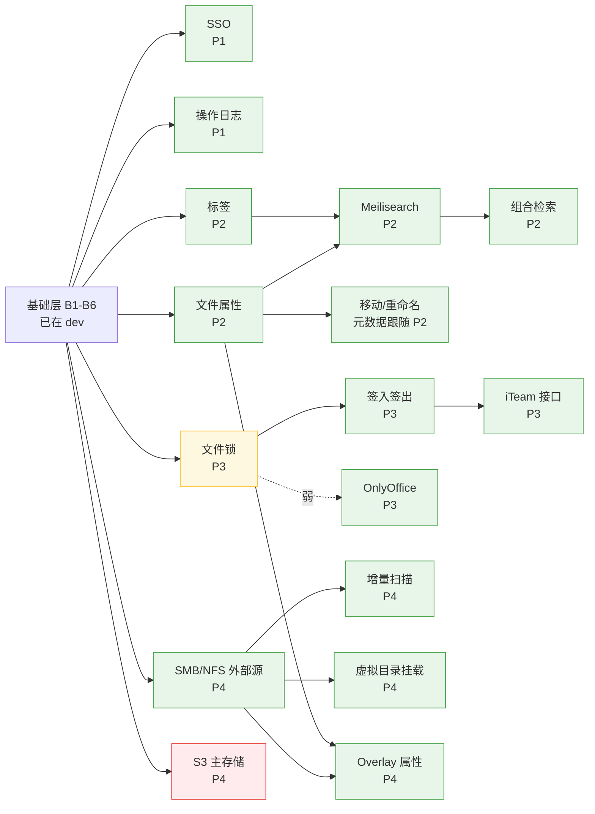

# 特性分支与持续维护

三仓通用。配套：[BRANCHING.md](../BRANCHING.md)（分支模型）、
[FEATURES.md](FEATURES.md)（特性状态）、
[upstream-patches/](upstream-patches/)（上游改动登记）。

---

## 一、分支只分两类，标准不是功能大小

CloudFile 是长期跟随上游的 fork，**唯一持续产生成本的东西是"修改了多少上游文件"**。
新增文件永远不会和上游冲突；改一个上游文件，则每次同步都要再付一次。

当前实测：

| 仓库 | 修改上游文件 | 新增文件 |
|---|---|---|
| cloudfile-server | 8 | 12 |
| cloudfile-hub | 3 | 34 |
| cloudfile-docker | 3 | 16 |
| **合计** | **14** | **62** |

62 个新增文件的维护成本接近于零，全部成本集中在那 14 个。分支因此分两类：

| 类型 | 定义 | Review 强度 |
|---|---|---|
| **基础分支** | 改动上游文件，或改动跨仓契约（规格、RPC、schema、构建） | 高。必须说明为何无法改成新增文件；同步更新登记清单与 BRANCHING.md |
| **特性分支** | 只新增文件（`cloudfile_ext/`、`common/cf-*`、`docs/` …） | 常规。可并行、可乱序合并 |

> 一个特性只要不动上游文件，它多大都不影响维护成本；只要动了，它多小都要按基础分支对待。

---

## 二、基础层（已完成，在 `dev`）

这六项是全部后续特性的地基，**不再单独开分支**，改动它们等同于改动跨仓契约：

| # | 基础能力 | 位置 | 谁依赖它 |
|---|---|---|---|
| B1 | 分支模型与发布清单 | `release.yaml`、`BRANCHING.md` | 全部 |
| B2 | 扩展框架（开关 + 注册中心 + hooks） | `cloudfile_ext/{features,registry,hooks}.py` | 全部 Hub 侧特性 |
| B3 | 三个上游注入点 | `rooturl.py`、`views/__init__.py`、`webpack.entry.js` | 全部 Hub 侧特性 |
| B4 | `cf_*` 数据层约定 | `scripts/sql/*/cloudfile.sql`、`db_router.py`、每次启动建表 | 全部需要建表的特性 |
| B5 | 交付通道 | `build/`、`image/`、`deploy/compose/` | 全部 |
| B6 | 规格 + 共享用例集模式 | `docs/acl-semantics.md`、`acl-cases.json`、双端测试 | 全部需要跨层一致的特性 |

**B3 是关键投资**：`check_folder_permission` 一个钩子覆盖 255 处调用点，
`register_urls` 覆盖全部路由。正因为它已经铺好，后面十几个特性才都能做到"零上游改动"。

---

## 三、特性依赖图



绿 = 零上游改动；黄 = 复用已登记文件；红 = 需要新增登记项。

**七个特性没有任何前置依赖**（SSO、操作日志、文件属性、标签、文件锁、外部源、S3），
可以完全并行。其余都挂在它们后面。

---

## 四、上游改动成本（实测，非估算）

这是排期的真正依据。同样是"要动 C 代码"，边际成本可以差一个数量级：

| 特性 | 上游成本 | 依据 |
|---|---|---|
| SSO | **0** | `EXTRA_AUTHENTICATION_BACKENDS` + `register_urls()` |
| 操作日志（Hub 侧） | **0** | 已预留 post 文件操作钩子（吞异常，不影响写入） |
| 文件属性 / 标签 | **0** | 纯 `cloudfile_ext` + `cf_*` 表 |
| Meilisearch / 组合检索 | **0** | `register_search_indexer()` + `cf-worker` + `search` profile |
| OnlyOffice | **0** | 纯 Hub；`office` profile 已就位 |
| SMB/NFS 及其派生 | **0** | `register_external_source_provider()` |
| **文件锁** | **0 新增登记项** | 新 RPC 落在 `rpc-service.c` / `seafile-rpc.h` / `seaf-server.c`——**三个都已登记**。且 CE 已存在 `FileLocks` 表却无人使用，schema 现成 |
| **S3 主存储** | **1 新增登记项** | 新写 `common/obj-backend-s3.c`（新文件）+ 改 `common/obj-store.c:28` 的后端选择（目前硬编码 `obj_backend_fs_new`）。**seafobj 上游已自带 s3/ceph/swift/alioss 后端**，Python 读取侧无需 fork |

两个反直觉结论，值得在排期时用上：

1. **文件锁比看起来便宜得多。** 它复用 ACL 已经打通的 RPC 通道，且 CE 早已建好
   `FileLocks` 表。可以早做，不必等到 P3 末尾。
2. **S3 也比预想便宜。** 原以为要连 seafobj 一起 fork，实测上游已支持。
   代价收敛到一个 `obj-store.c` 的后端选择改动。

---

## 五、分支命名与跨仓协作

分支名对齐开关名，一眼能看出对应哪个能力：

```
feature/sso              ← CF_ENABLE_SSO
feature/audit            ← CF_ENABLE_AUDIT
feature/file-lock        ← CF_ENABLE_CHECKOUT 的前置
fix/<简述>
sync/upstream-YYYYMMDD
```

**跨仓特性用同名分支。** 构建脚本原生支持，不需要临时改 `release.yaml`：

```bash
CF_SERVER_REF=feature/file-lock CF_HUB_REF=feature/file-lock \
  ./build/cloudfile_14.0/cloudfile-build.sh 14.0.0-cf.0-dev
```

可覆盖的变量：`CF_SERVER_REF`、`CF_HUB_REF`、`CF_SERVER_URL`、`CF_HUB_URL`、
`CF_SEAFOBJ_REF`、`CF_SEAFDAV_REF`、`CF_SEAFEVENTS_REF`、`CF_LIBSEARPC_REF`、
`CF_LIBEVHTP_REF`。合并回 `dev` 后**不要**把这些留在脚本里——
`release.yaml` 是唯一真相来源。

---

## 六、合并门槛

每个特性分支合并进 `dev` 前必须全部满足：

1. **开关默认关闭**，`.env.example` 里也是 `false`。
2. **全部开关关闭时，行为与原生 CE 一致**。这是 P0 的验收项，也是每次合并的验收项。
3. **上游改动登记检查通过**：
   ```bash
   ./tools/check-upstream-patches.sh
   ```
   清单变长则拒绝合并，除非同时更新了登记文件和 `BRANCHING.md` 并说明理由。
4. **涉及跨层语义的，两端实现跑同一份用例集**：
   ```bash
   cd cloudfile-hub && python3 -m pytest cloudfile_ext/ -q
   ```
   ```bash
   cd cloudfile-server && ./tests/cf-acl/run.sh
   ```
5. **[FEATURES.md](FEATURES.md) 状态已更新**，且严格区分 ✅（有验证证据）与
   🟡（写完未验证）。把未验证的标成已完成，是这份文档唯一会失去价值的方式。

---

## 七、持续跟随上游

```bash
git fetch upstream master
git checkout -b sync/upstream-$(date +%Y%m%d) dev
git merge upstream/master
```

冲突只会出现在登记清单里的那 14 个文件上，其余 62 个新增文件不参与。
合并后：

```bash
./tools/check-upstream-patches.sh
```
```bash
# 更新 release.yaml 的 upstream: SHA，然后跑原生 CE 回归
```

**建议节奏**：跟随上游 **master 每月一次**。间隔越长，14 个文件里累积的漂移越难
分辨"上游改了什么"和"我们改了什么"——尤其是 `rpc-service.c` 和
`seahub/views/__init__.py` 这种上游本身也在动的文件。

### 让成本可见

`tools/check-upstream-patches.sh` 是把"少改上游"从口号变成约束的地方。
建议接进三仓的 CI；本地也可以挂 pre-push：

```bash
ln -s ../../../cloudfile-docker/tools/check-upstream-patches.sh .git/hooks/pre-push
```

当前状态由它自己报告，不靠人记：

```
=== cloudfile-server ===  ✓ 8 个上游文件，与清单一致
=== cloudfile-hub ===     ✓ 3 个上游文件，与清单一致
=== cloudfile-docker ===  ✓ 3 个上游文件，与清单一致
```

---

## 八、建议排期

按"解除阻塞的能力"而不是按 P 编号排：

| 顺序 | 内容 | 理由 |
|---|---|---|
| **0** | 构建镜像 + 启动 Compose + 跑通 ACL 六入口矩阵 | 20 个 🟡 项全部卡在这一步，且它验证的是基础层本身。**在此之前不宜开新特性分支** |
| 1 | SSO、操作日志（并行） | 零上游成本，且是企业部署的准入条件 |
| 2 | 文件属性 + 标签（并行） | 零成本，解锁 P2 全部 |
| 3 | 文件锁 | 零新增登记项，且解锁签入签出与 OnlyOffice 并发安全 |
| 4 | Meilisearch → 组合检索 | 严格依赖第 2 步 |
| 5 | OnlyOffice → 签入签出 → iTeam | 链式依赖 |
| 6 | SMB/NFS → 扫描 / 虚拟目录 / Overlay | 独立，可随时插入 |
| 7 | S3 主存储 | 唯一会抬高长期维护成本的一项，放最后，落地前重新评估是否真的需要 |
