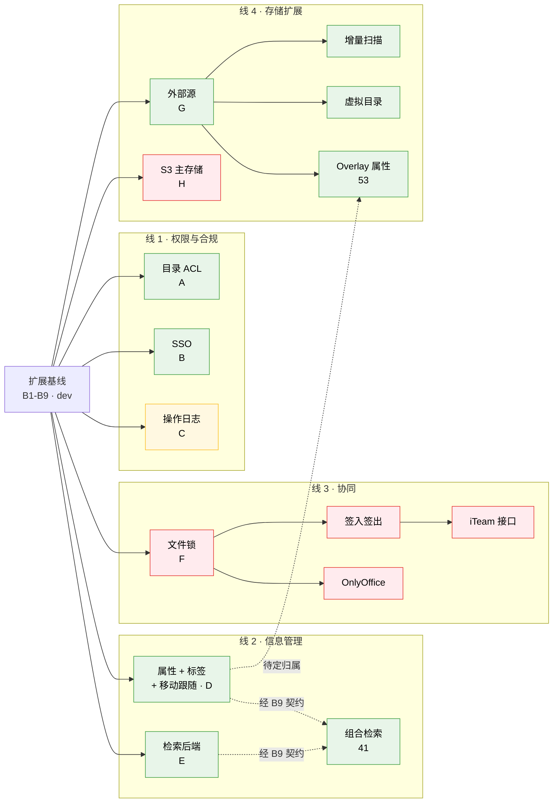

# 特性分支与持续维护

三仓通用。配套：[BRANCHING.md](../BRANCHING.md)（分支模型）、
[FEATURES.md](FEATURES.md)（特性状态）、
[EXTENSION-POINTS.md](EXTENSION-POINTS.md)（扩展点清单与关联矩阵）、
[upstream-patches/](upstream-patches/)（上游改动登记）。

---

## 一、分支只分两类，标准不是功能大小

CloudFile 是长期跟随上游的 fork，**唯一持续产生成本的东西是"修改了多少上游文件"**。
新增文件永远不会和上游冲突；改一个上游文件，则每次同步都要再付一次。

当前实测（`dev`，即扩展基线）：

| 仓库 | 修改上游文件 | 新增文件 |
|---|---|---|
| cloudfile-server | 8 | 6 |
| cloudfile-hub | 5 | 29 |
| cloudfile-docker | 3 | 28 |
| **合计** | **16** | **63** |

新增文件的维护成本接近于零，全部成本集中在那 16 个。

**把目录 ACL 整个剥到 `feature/dir-acl` 之后，这些数字一个都没变**——
变的只有新增文件数。这正是扩展点设计到位的证据：能力来去不影响 fork 成本。

> 从 14 涨到 16 的那两个是检索扩展点（`seahub/search/utils.py` 与
> `seahub/utils/__init__.py`）。它们是**基线投资**，不是某个能力的成本：
> 铺好之后 meilisearch、seasearch、企业自有检索都是零上游改动的 provider。
> 这正是本文档第一节那条规则的用法——与其让每个检索方案各改一次上游，
> 不如基线改一次。详见 [EXTENSION-POINTS.md](EXTENSION-POINTS.md) 第六节。

分支因此分两类：

| 类型 | 定义 | 归属 | Review 强度 |
|---|---|---|---|
| **扩展基线** | 扩展点、构建、部署、发布机制。改动上游文件或跨仓契约 | `dev` | 高。必须说明为何无法改成新增文件；同步更新登记清单与 BRANCHING.md |
| **能力** | 一个具体能力，只新增文件 | `feature/*` 开发，**验收后合回 `dev`** | 常规。可并行开发 |

> 一个能力只要不动上游文件，它多大都不影响维护成本；只要动了，它多小都要按基线改动对待。

这对基线提出了一条硬要求：

> **扩展点必须完整到让能力不再需要新增任何上游改动。**

否则多个能力会在同样的行上互相冲突。当前状态是达标的——把 ACL 从 `dev`
剥离出去时，三个仓的上游改动清单**一个字节都没变**。

### 能力必须汇流回 `dev`，不能长期分叉

**这条曾经写反过**，写的是"能力分支长期存在、不预期合并回 `dev`"。
那在只有一个能力时看不出问题，到八个就塌了。原因是构建脚本每个仓库只认
**一个** ref：

```
checkout_ref seafile-server "$cloudfile_server_ref"
checkout_ref seahub         "$cloudfile_hub_ref"
```

于是 `CF_HUB_REF=feature/dir-acl` 能构建"基线 + ACL"，但客户要
**ACL + 属性 + 检索**时，没有任何一条分支上有这三样。你只能临时造一条
`feature/acl+metadata+search` 合并分支——而那个组合从来没人构建过、没人测过。
八个能力各占一条长期分支 ⇒ 理论上 2⁸ 种交付组合，**每一种都是没验证过的新代码**。

解药项目里本来就有：**"全部开关关闭 = 原生 CE"** 这条铁律，正是让能力可以
安全地住在 `dev` 上的机制。长期分支想解决的隔离问题，开关已经解决了；
而长期分支带来的组合爆炸，开关解决不了。

因此：

```
dev = 扩展基线 + 已验收能力，全部开关默认关闭
feature/* = 正在开发的能力。验收通过 → 合回 dev → 删除分支
```

门禁仍然分两层，各跑各的，互不阻塞：

| 门禁 | 开关状态 | 内容 |
|---|---|---|
| 基线门禁 | 全关 | `smoke.py`（原生 CE 行为）+ `baseline.py`（扩展点已装但未启用） |
| 能力门禁 | 只开自己那个 | 该能力自己的用例集，例如 ACL 的六入口矩阵 |

原先"基线发布不该被某个能力的验收结果卡住"的顾虑，由**开关默认关**保证，
不需要靠分支隔离——一个能力的门禁挂了，把开关留在关闭状态照样能发基线。

#### 什么情况下才真的需要长期分支

只有一条判据：

> **该能力不打算进入产品。** 客户定制、实验性方案、许可证不兼容的实现。

按这条判据，当前八个能力簇里长期分支数量是 **0**。`feature/dir-acl` 也不例外——
它应该在六入口矩阵跑通后合回 `dev`，而不是永久分叉。

能力分支上如果发现必须新增上游改动，正确做法是**先给基线加扩展点**，
而不是在分支上改上游文件。

### 分支活得越久，腐坏得越彻底

这是"尽快合回 `dev`"的第二个理由。`feature/dir-acl` 是活的反例：它停在基线
剥离前的那个提交上，此后 `dev` 上的六个构建修复它一个都没有，
**那条分支上的镜像根本构建不出来**——而分支本身看起来完全正常。

在分支还开着的期间：

1. **每次 `dev` 上有构建或扩展点相关改动，分支跟进一次。** 其余情况每周一次。
2. **跟进后跑一次该能力自己的门禁**，不只是构建。
3. **跟进前先查是不是快进**（见第九节）。

腐坏的成本是非线性的：落后一个提交是 rebase，落后六个提交且其中包含构建系统
改动，就是重新调试一遍集成边界。

---

## 一之二、真实的耦合在哪里

十七个特性各开一条分支不可维护；但按"主题相似"合并会制造假耦合。判定标准
只有四条，**共享其中任何一条就必须同一分支，都不共享就能独立**：

① 同一张 `cf_*` 表　② 同一份跨层规格/用例集　③ 同一个新增上游补丁　④ 运行时直接互调

**不构成耦合**（这几样看着像，实则被扩展点隔开了）：共用同一个扩展点链
（链本来就支持多注册者）、共用同一个 provider kind（不同 name 互不影响）、
共用同一个 compose profile（部署选项不是代码耦合）、单向数据流经基线契约。

按此收敛出 **八个真实簇**：

| 簇 | 特性 | 绑在一起的原因 |
|---|---|---|
| **A 目录权限** | 13–35, 66 | `cf_dir_acl` 表 +`acl-cases.json` 用例集**同时驱动 C 与 Python 两端**，改语义必须同时改两处 |
| **B 身份与目录同步** | 36, 76–88 | `cf_sso_*` 表 + 组织映射规格。**登录后端是打包不是构建**（见下），真正要构建的是目录/组同步 |
| **C 操作日志** | 37 | `cf_audit_log` 表。⚠️ 阻塞在 `file_op` 基线缺口上 |
| **D 元数据** | 38 属性, 39 标签, 42 移动跟随 | **同一张表**。标签是属性的特化；42 是 38/39 的正确性要求，不是独立特性 |
| **E 检索** | 40 后端 | 自有索引，不碰 `cf_*` |
| **F 协同** | 43–48 | 同一份**锁语义**：签入签出、超时解锁、OnlyOffice 并发都是"谁正持有这个文件"的不同表述 |
| **G 外部源** | 50–52 | `cf_external_source` 表 + 同一套挂载语义 |
| **H 存储后端** | 49 S3 | `common/obj-store.c` 后端选择，与 Hub 侧零交集 |
| **I 反病毒** | Antivirus | server/pipeline 侧扫描，镜像已剥离 clamav。**Pro 对标里唯一"缺失机制"且未归簇的一项**——见 [pro-parity.md](pro-parity.md) |

> **开关粒度 ≠ 分支粒度。** D 是一条分支、三个特性、两个开关
> （`CF_ENABLE_METADATA` 与 `CF_ENABLE_TAGS`）。属性和标签共享同一张表，
> 拆成两条分支等于两条分支各自定义同名表的 schema。

### 一之二·五、打包 ≠ 构建：不是所有 Pro 特性都该开分支

按 [Pro vs CE 对比](https://www.seafile.com/en/pricing/?produce=on-premises)
逐项核对后（全表见 [pro-parity.md](pro-parity.md)），发现一个贯穿性的事实：
**Pro/CE 是营销线，不是源码线**。对比页标成 Pro 独占的特性里，**大半代码本来
就在 CE 开源仓里**——由普通 settings 开关或纯营销门控，而非 `is_pro_version()`：

```bash
grep -rln is_pro_version seahub/adfs_auth/ seahub/oauth/ \
    seahub/role_permissions/ seahub/two_factor/ seahub/base/accounts.py   # → 空
```

LDAP 登录、ADFS/SAML、Shibboleth、角色管理、2FA、设备远程擦除、WebDAV——**源码俱在**。
它们不是"要构建的机制"，是"要启用的配置"。据此，特性分成两层：

| 层 | 判据 | 是不是 `feature/*` 分支？ |
|---|---|---|
| **打包** | CE 源码已有，只是默认关/营销门控 | **不是**。它是 bootstrap 的一段配置 + 一张启用清单 |
| **构建** | CE 里没有这个机制，要写新代码 | **是**，就是上面八个（+I）耦合簇 |

**这对"优化特性分支"的直接后果**：

1. **打包层移出分支计划。** 给一个上游 settings 开关（如 `ENABLE_TWO_FACTOR_AUTH`）
   再套一条分支和一个 `CF_ENABLE_*`，是纯粹的过度封装。做法与已落地的 OAuth
   （bootstrap `_settings_block_sso` 从 `.env` 写上游设置）完全一致——加配置，
   不加分支。铁律不变：默认关 = 原生 CE，只是这些开关是**上游自己的**。
2. **簇 B 由"SSO"更名为"身份与目录同步"**：登录后端是打包，真正要构建的只有
   目录/组同步。对比页把 "Authenticate against LDAP/AD" 与 "Syncing LDAP/AD
   Users and Groups" 分成两行，正好印证——前者打包，后者才是 CloudFile 的组织
   映射（特性 76–88）已经做的事。补一个 `ldap` 目录源即与 Pro 对齐。
3. **Antivirus 立为簇 I**：它是"缺失机制"里唯一还没归簇、且较重的一项
   （server 侧扫描、镜像已剥离 clamav）。落地前先做一次门控盘点。

**净效果**：Pro 对比表约一半特性 CloudFile **已有源码、只差启用**（打包层，
应最先清，拿下企业准入）；要真写的机制集中在既有耦合簇里，外加 Antivirus。

### 两个跨簇依赖，靠契约解开

只有两处特性同时依赖两个簇。它们是这次切分里唯一需要动设计的地方。

**① 组合检索（41）= D × E。** 属性/标签 + 内容的联合查询。

若不处理，41 只能落在 D 或 E 其中一条上，那条分支就不再能独立验收。
解法是**把结构化过滤提升进基线的 provider 契约**
（`cloudfile_ext/search_query.py`，已实现）：

- **D** 只管往索引喂字段，并用这套词汇发起查询
- **E** 只管把这套词汇翻译成自己后端的过滤语法

各自可独立验收——D 用假 provider 验"字段进了索引"，E 用合成文档验"过滤正确"。
41 的端到端验收需要两者同时在场，那属于 `dev` 上的**集成门禁**，不属于任一分支。

契约里有一条刻意的强硬规定：**provider 必须声明自己支持哪些算子，收到未声明
的算子一律拒绝，不允许静默忽略。** 被丢掉的谓词会返回比请求更大的结果集，
而调用方无法区分"没有文件带这个标签"和"标签条件被忽略了"——两种情况看起来
一模一样。

**② Overlay 属性（53）= G × D。** 给外部源对象附加属性。
同样的解法：D 的属性存储契约以"对象标识"为键，不绑定 repo/commit 模型
（外部源本来就不进那个模型），G 按契约写入即可。
若不想现在投入，**把 53 推迟**，等 D 落地后再定归属。

---

## 一之三、四条并行开发线

分支不是能力的永久住所，而是**工作流**：做完、验收、合进 `dev`、删掉。

| 线 | 内部顺序 | 并行安全性 | 上游成本 |
|---|---|---|---|
| **1 权限与合规** | A 目录权限 → B SSO → C 操作日志 | 与其余三线无共享 | A: 0 / B: 0 / **C: 需先补基线 `file_op` 分发点** |
| **2 信息管理** | D 元数据 ∥ E 检索 → 41 组合检索 | D 与 E 靠过滤契约解耦后**可真并行** | 0（检索扩展点基线已付） |
| **3 协同** | F: 文件锁 → 签入签出 → OnlyOffice → iTeam | 独占锁语义与 `cf_lock` | ⚠️ **唯一有新增上游补丁的线**（Hub 侧拆 `is_pro_version()` 门控） |
| **4 存储扩展** | G 外部源 → 扫描 → 虚拟目录　∥　H S3 | G 与 H 技术上无关，可各自推进 | G: 0（但要付"另起入口"的产品代价）/ H: 1 个新增登记项 |

同一时刻活着的 `feature/*` 分支：**每条线一条，最多四条。**

线内串行是因为真有依赖（锁 → 签入签出 → iTeam），不是因为人手。四条线之间
不共享表、规格或上游补丁，所以可以真并行——**唯一要协调的是线 3 的上游补丁
review，它会让 Hub 的登记清单变长。**

---

## 二、扩展基线（在 `dev`）

这些是全部能力的地基，**不再单独开分支**，改动它们等同于改动跨仓契约：

| # | 基础能力 | 位置 | 谁依赖它 |
|---|---|---|---|
| B1 | 分支模型与发布清单 | `release.yaml`、`BRANCHING.md` | 全部 |
| B2 | 扩展框架（开关 + 注册中心 + hooks） | `cloudfile_ext/{features,registry,hooks}.py` | 全部 Hub 侧特性 |
| B3 | 五个上游注入点 | `rooturl.py`、`views/__init__.py`、`search/utils.py`、`utils/__init__.py`、`webpack.entry.js` | 全部 Hub 侧特性 |
| B8 | provider 机制 + 外部服务回调 | `providers.py`、`external_service.py` | 检索后端、ACL 规则来源 |
| B9 | 结构化过滤契约 | `search_query.py` | **解开 D 元数据 × E 检索的耦合**，使两条能否独立验收 |
| B4 | `cf_*` 数据层约定 | `db_router.py`、bootstrap 每次启动执行 `cloudfile.sql`（基线不带表，能力自带） | 全部需要建表的能力 |
| B5 | 交付通道 | `build/`、`image/`、`deploy/compose/` | 全部 |
| B6 | server 侧扩展点 | `common/cf-ext.{c,h}`：能力注册表 + 权限/列举/子树三个分发钩子 | 全部需要底层强制的能力 |
| B7 | 基线门禁 | `tests/e2e/smoke.py`（原生 CE 行为）+ `baseline.py`（扩展点已装好但未启用） | — |

**B3 与 B6 是关键投资**：Hub 侧 `check_folder_permission` 一个钩子覆盖 255 处
调用点；server 侧 8 个上游文件一次性改好后全部调进 `cf-ext.c`。正因为这两处已经
铺好，后面十几个能力才都能做到"零上游改动"。

`cf_ext_init()` 里不注册任何能力，所以基线上每个钩子都是透传。一个能力只需要
新增 `common/cf-<能力>.c`、在 `cf-ext.c` 里加一行注册、在 `Makefile.am` 加一行
（三者全部零成本）。

**B9 是这次分支切分的产物**：没有它，组合检索会把元数据和检索焊成一条大分支。
一次基线投资换两条线可以并行——这正是第一节那条规则最典型的用法。

---

## 三、特性依赖图

按开发线分组。**虚线是跨线依赖**——只有两条，都已由基线契约解开。



绿 = 零上游改动；黄 = 阻塞在基线缺口上；红 = 需要新增登记项。

**八个簇里有六个没有任何前置依赖**，四条线之间不共享表、规格或上游补丁，
所以可以真并行。线内的串行是真依赖，不是人手限制。

两条虚线是仅有的跨线依赖，处理方式已经确定：组合检索经 B9 结构化过滤契约
（两边各自可独立验收）；Overlay 属性的归属待 D 落地后再定，**不阻塞线 4 的
前三项**。

---

## 四、上游改动成本（实测，非估算）

这是排期的真正依据。同样是"要动 C 代码"，边际成本可以差一个数量级。

**这张表拆成两列，因为原先的单列"0"把两种完全不同的东西混在了一起**：一个特性
可以做到零上游改动，却是靠"另起一个入口"换来的——用户会看到两套界面。那不是
零成本，只是把成本从维护挪到了产品。**融入原生 UI** 一列就是用来问这个问题的。

| 特性 | 新增登记项 | 融入原生 UI | 依据 |
|---|---|---|---|
| SSO 登录 | **0** | ✅ 是 | **上游 CE 已自带**：`seahub/oauth/`（OAuth2/OIDC）、`adfs_auth/`（SAML）、`django_cas_ng/`、LDAP、REMOTE_USER，**一处 Pro 门控都没有**，依赖也在发行包里。打开它只是往配置块写标量。原先记的"`EXTRA_AUTHENTICATION_BACKENDS` + `register_urls()`"其实高估了——**连后端都不用写**。见 [upstream-reuse.md](upstream-reuse.md) 探针 0 |
| SSO 组织映射 | **0** | ✅ 是 | 上游**没有**通用目录的组织映射（企业微信/钉钉那两个用的 `external_department.outer_id` 是 BIGINT，装不下 OIDC 组 claim 或 LDAP DN）。用现成扩展点：provider + `register_periodic_task` + `register_urls` + 上游自己的 `user_logged_in` 信号 |
| 文件属性 / 标签 | **0** | ⚠️ 见下 | 纯 `cloudfile_ext` + `cf_*` 表 |
| **操作日志 / 审计** | **⚠️ 待定** | ✅ 是 | **原先记的 0 不成立**：`file_op` 钩子无任何上游触发点，seahub 的 `signals.py` 也没有删除/移动/重命名/下载信号。建议改到 server 侧 `cf-ext.c`——那是一次基线改动。见 [EXTENSION-POINTS.md](EXTENSION-POINTS.md) 缺口 1 |
| Meilisearch / 组合检索 | **0**（基线已付） | ✅ 是 | 基线已铺好 `register_search_provider()` + 两处上游改动；具体后端是 provider，零改动 |
| OnlyOffice | **0** | ✅ 是 | **上游 CE 已自带 `seahub/onlyoffice/`**（views/converter/callback 全套），只有锁集成两行是 Pro 门控。规模远小于原估 |
| SMB/NFS 及其派生 | **0** | ❌ **否** | `register_external_source_provider()` 只能经自有路由暴露。要出现在原生库列表里需改上游列举逻辑。见缺口 3 |
| **文件锁** | **0（server 侧）+ ⚠️（Hub 侧）** | ✅ 是 | server 侧确实免费：`seafile_mark_file_locked` RPC 与 `FileLocks` 表上游都已存在。但 Hub 侧锁语义被 `is_pro_version()` 门控，散在 `views/file.py`、`onlyoffice/views.py`、`seadoc/apis.py`、`exdraw/apis.py`，**均未登记**。见缺口 5 |
| **S3 主存储** | **1 新增登记项** | — | 新写 `common/obj-backend-s3.c`（新文件）+ 改 `common/obj-store.c:28` 的后端选择（目前硬编码 `obj_backend_fs_new`）。**seafobj 上游已自带 s3/ceph/swift/alioss 后端**，Python 读取侧无需 fork |

### 五个反直觉结论

0. **SSO 里贵的那一半，和原先以为的不是同一半。** 登录整套上游都有；缺的是
   组织映射，而它原先根本没被单独计价。总量没变小，**形状变了**——按原计划
   动工会得到一个能登录、但组织结构仍要手工维护的东西，而后者才是企业提这个
   需求的原因。这条也是"先查上游再动工"这个习惯的第一个样本：花十分钟
   `grep -rl is_pro_version`，省下一个认证后端的长期维护。

1. **S3 比预想便宜。** 原以为要连 seafobj 一起 fork，实测上游已支持。
   代价收敛到一个 `obj-store.c` 的后端选择改动。

2. **审计比预想贵。** 它是唯一一个原先记 0、实测**根本没有触发点**的特性。
   钩子注册得了，但没有任何上游代码会调用它——注册了一个永不触发的回调。

3. **文件锁只有一半便宜。** server 侧确实是白捡的，Hub 侧要拆 Pro 门控。
   排期时按"半个基线改动"算，不要按 0 算。

4. **上游 CE 14.0 已经带了 P2/P3 的一大半。** `seahub/repo_metadata/`（完整
   API + 前端，无 Pro 门控，只缺闭源的 metadata-server）、`seahub/tags/`、
   `file_tags/`、`repo_tags/`、`seahub/onlyoffice/`、seasearch 集成——**都在 CE 里**。
   在 `cloudfile_ext` 里另起一套属性/标签系统，等于把上游已开源的前端和 API
   重写一遍。这是当前 roadmap 里最大的一块可省工作量，见第八节第 1 步的探针。

---

## 五、分支命名与跨仓协作

分支名对齐**耦合簇**，不是对齐单个特性——一个簇一条分支：

```
feature/dir-acl          ← 簇 A（CF_ENABLE_DIR_ACL）
feature/sso              ← 簇 B（CF_ENABLE_SSO）
feature/audit            ← 簇 C（CF_ENABLE_AUDIT）
feature/metadata         ← 簇 D（CF_ENABLE_METADATA + CF_ENABLE_TAGS，两个开关一条分支）
feature/search           ← 簇 E（CF_PROVIDER_SEARCH 的一个实现）
feature/collab           ← 簇 F（CF_ENABLE_CHECKOUT + CF_ENABLE_ONLYOFFICE）
feature/external-sources ← 簇 G（CF_ENABLE_EXTERNAL_SOURCES）
feature/s3               ← 簇 H（CF_ENABLE_S3_STORAGE）
fix/<简述>
sync/upstream-YYYYMMDD
```

**跨仓能力用同名分支。** 构建脚本原生支持，不需要临时改 `release.yaml`：

```bash
CF_SERVER_REF=feature/dir-acl CF_HUB_REF=feature/dir-acl \
  ./build/cloudfile_14.0/cloudfile-build.sh 14.0.0-cf.0-dir-acl
```

开发中的分支用这种方式构建自己的镜像，再跑自己的门禁。**注意每个仓库只能给
一个 ref**——这正是能力必须尽快合回 `dev` 的原因：两个尚未合并的能力无法一起
构建，也就无法一起交付。合回 `dev` 之后，组合由开关决定，不再需要合并分支。

可覆盖的变量：`CF_SERVER_REF`、`CF_HUB_REF`、`CF_SERVER_URL`、`CF_HUB_URL`、
`CF_SEAFOBJ_REF`、`CF_SEAFDAV_REF`、`CF_SEAFEVENTS_REF`、`CF_LIBSEARPC_REF`、
`CF_LIBEVHTP_REF`。合并回 `dev` 后**不要**把这些留在脚本里——
`release.yaml` 是唯一真相来源。

---

## 六、合并门槛

一个能力**合回 `dev`** 前必须全部满足。这是唯一一道闸门——过了就进主干，
往后由开关控制是否启用，不再靠分支隔离：

1. **开关默认关闭**，`.env.example` 里也是 `false`。
2. **全部开关关闭时，行为与原生 CE 一致**。这是 P0 的验收项，也是每次合并的验收项。
   它同时是本模型能成立的前提——正因为有这一条，能力住在 `dev` 上才不会影响
   任何未启用它的部署。
3. **上游改动登记检查通过**：
   ```bash
   ./tools/check-upstream-patches.sh
   ```
   清单变长则拒绝合并，除非同时更新了登记文件和 `BRANCHING.md` 并说明理由。
4. **涉及跨层语义的，两端实现跑同一份用例集**，规格与用例集随能力一起进
   `docs/`：
   ```bash
   cd cloudfile-hub && python3 -m pytest cloudfile_ext/ -q
   ```
   ```bash
   cd cloudfile-server && ./tests/cf-<能力>/run.sh
   ```
5. **该能力自己的 E2E 门禁通过**（例如 ACL 的六入口矩阵），且**这道门禁随能力
   一起进 `dev`**，作为一个开着自己开关跑的 CI job。基线门禁不测试任何具体能力，
   所以这一条只能由能力自己保证。
6. **不与已在 `dev` 上的能力冲突**：不重名 `cf_*` 表、不重名 provider、
   不与既有能力争夺同一段上游代码。四条线之间已按耦合切开，正常情况下这条
   自动满足；**触发它就说明簇划分错了**，应该回头合并两个簇而不是硬合。
7. **[FEATURES.md](FEATURES.md) 状态已更新**，且严格区分 ✅（有验证证据）与
   🟡（写完未验证）。把未验证的标成已完成，是这份文档唯一会失去价值的方式。

合并后**删除分支**。它的历史已经在 `dev` 上，留着只会诱使别人从一个过期的
起点继续开发。

---

## 七、持续跟随上游

```bash
git fetch upstream master
git checkout -b sync/upstream-$(date +%Y%m%d) dev
git merge upstream/master
```

冲突只会出现在登记清单里的那 16 个文件上，其余 63 个新增文件不参与。
合并后：

```bash
./tools/check-upstream-patches.sh
```
```bash
# 更新 release.yaml 的 upstream: SHA，然后跑原生 CE 回归
```

**建议节奏**：跟随上游 **master 每月一次**。间隔越长，16 个文件里累积的漂移越难
分辨"上游改了什么"和"我们改了什么"——尤其是 `rpc-service.c`、
`seahub/views/__init__.py` 和 `seahub/utils/__init__.py` 这种上游本身也在动的文件。

### 让成本可见

`tools/check-upstream-patches.sh` 是把"少改上游"从口号变成约束的地方。
建议接进三仓的 CI；本地也可以挂 pre-push：

```bash
ln -s ../../../cloudfile-docker/tools/check-upstream-patches.sh .git/hooks/pre-push
```

当前状态由它自己报告，不靠人记：

```
=== cloudfile-server ===  ✓ 8 个上游文件，与清单一致
=== cloudfile-hub ===     ✓ 5 个上游文件，与清单一致
=== cloudfile-docker ===  ✓ 3 个上游文件，与清单一致
```

---

## 八、建议排期

> **起跑线校正**：基线门禁已在本机跑通（12/12 冒烟 + 6/6 扩展点，提交 `ced53b2`），
> 原第 0 步只剩"在 CI 上再跑一次"。别按旧文档的"镜像从未构建过"来排期。

### 前置（四条线都等它）

| 顺序 | 内容 | 理由 |
|---|---|---|
| **0** | 基线门禁在 **CI 上**跑通一次 | 本机已通过；CI 与本机的差异（架构、磁盘、PATH）是最后一个未验证面 |
| **0.5** | 三个决策探针 | 结论直接改写线 2 与线 3 的规模。**探针 1、3 已做**（[upstream-reuse.md](upstream-reuse.md)），线 2 已定型；探针 2（OnlyOffice）仍未做 |

### 四条线并行

线内串行，线间并行。每条线同时只有一条 `feature/*` 活着，验收后合回 `dev` 并删除。

| 线 | 顺序 | 内容 | 备注 |
|---|---|---|---|
| **1** | 1.1 | 重建 `feature/dir-acl` → 六入口矩阵 → 合回 `dev` | **不是"只差验证"**：分支已腐坏，见第九节。含 WebDAV 读侧补丁（发布阻塞项） |
| | 1.2 | SSO | **代码已完成于 `feature/sso`，门禁未跑过** —— 登录复用上游，CloudFile 只做配置与组织映射。规格 [sso-mapping.md](sso-mapping.md)，探针 [upstream-reuse.md](upstream-reuse.md)。合回 `dev` 前先跑 `verify-local.sh cap sso` |
| | 1.3 | 审计 | ⚠️ **先补基线 `file_op` 分发点**，那是一次基线改动，按基线标准 review |
| **2** | 2.1a | 元数据（属性 + 标签 + 移动跟随） | **探针 1 已定：CloudFile 自建存储引擎说 metadata-server 协议**（唯一闭源件）+ 复用上游前端/API/投喂管线。分两步：官方 server 先验证，长期权威模型归 CloudFile |
| | 2.1b | 检索后端（与 2.1a **真并行**） | **探针 3 已定：默认 seasearch（上游已集成，零 CloudFile 代码）**，meilisearch 作可选 provider。扩展点与过滤契约已就位 |
| | 2.2 | 组合检索 | 需 2.1a + 2.1b 都进了 `dev`，验收属集成门禁 |
| **3** | 3.1 | 文件锁（含 Hub 侧 Pro 门控拆解） | 唯一有新增上游补丁的线，先过 review |
| | 3.2 | 签入签出 → OnlyOffice → iTeam | **OnlyOffice 规模待探针 2 定**：上游 CE 已带 `seahub/onlyoffice/` |
| **4** | 4.1a | 外部源 → 扫描 → 虚拟目录 | **先决定要不要付"另起入口"的产品代价**（缺口 3） |
| | 4.1b | S3 主存储（与 4.1a 无关，可各自推进） | 唯一抬高长期维护成本的一项，落地前重新评估是否真的需要 |
| | 4.2 | Overlay 属性 | 跨线依赖线 2，**等 D 落地后再定归属**，不阻塞 4.1a |

**人手不足时按线优先级取舍**：线 1 是企业准入的门槛，线 2 是产品差异化，
线 3 与线 4 可以整条推迟而不影响前两条——四条线之间没有技术依赖，
这正是按耦合切分的收益。

### 决策探针

产出都写进 [upstream-reuse.md](upstream-reuse.md)——那份文档里还有一个原本不在
计划内的**探针 0（SSO）**，它的结论改变了特性 36 的形状。

| # | 探针 | 状态 | 决定什么 |
|---|---|---|---|
| 1 | **metadata-server 协议探针** | ✅ 已做 | **实现一个兼容服务**。协议 316 行、完全已知；要重写的前端+API 是 352+88 前端文件 + 3745 行 apis.py，都在 CE。JWT 用 CloudFile 已生成的 `JWT_PRIVATE_KEY`。`/query` 的 SQL 方言贴近 SQLite、无真 JOIN，服务端只需执行不需生成 |
| 2 | **OnlyOffice 门控盘点**：数清 `is_pro_version()` 里哪些是真 Pro 依赖、哪些只是商业门控 | ⬜ 未做 | 3.2 的规模；顺带给 3.1 的 Hub 侧成本定量 |
| 3 | **seasearch vs meilisearch 选型** | ✅ 已做 | **seasearch，且不经我们的 provider**。它在 CE 里已完整集成、无 Pro 门控，走搜索视图里一条独立分支（`ai_search_files`），配 seafevents 即可。meilisearch 作可选 provider 保留 |

**探针的价值在于它可能让整段排期消失，而它兑现了。** 探针 1、3 已把线 2 从
"五个特性从零做"落定为"一个兼容服务 + 配置 seasearch，前端和 API 全部白拿
上游"。剩探针 2（OnlyOffice，属 P3/线 3）未做。

> **每个探针都是"先查上游再动工"的实证**：探针 0 省下一个认证后端，探针 1 省下
> 一套属性/标签前端，探针 3 省下一个自研检索方案。三次都是花十分钟到两天读代码，
> 换来砍掉数千行本要自己维护的重写。**这正是这个 fork 的成本模型：改动上游是
> 唯一持续付费项，而重写上游已开源的东西是它更贵的变体——不冲突，但永久自担。**

---

## 九、重建腐坏的能力分支（`feature/dir-acl`）

三个仓库的 `feature/dir-acl` 目前**都是 `dev` 的祖先**：

```bash
git merge-base --is-ancestor feature/dir-acl dev && echo "是祖先"
```

含义是它没有任何独有提交——ACL 代码是在 `dev` 上被剥离的（`0fa4ec2` /
`c1a501e38` / `c4de959`），而分支停在剥离前那个提交。两个后果：

1. **`git merge dev` 会快进**，分支指针直接跳到 `dev`，ACL 代码全部消失，
   而且不报任何冲突。文档里"周期性把 dev 合并进来"这条指令，
   在这个状态下会**静默删掉整个能力**。
2. 分支落后 `dev` 六个提交，其中全是构建修复，**该分支上的镜像构建不出来**。

### 不能用 revert 恢复

那三个剥离提交是**混合的**：既删了 ACL，也引入了扩展点本身
（`cf-ext.c/h`、`baseline.py`、构建修复）。整体 revert 会把扩展点一起撤掉。

### 正确步骤

```bash
git checkout feature/dir-acl && git merge dev     # 快进到最新基线（ACL 暂时消失）
```
```bash
git checkout <剥离前的提交> -- <该仓的 ACL 文件清单>   # 取回能力代码
```

然后**按新的扩展点 API 重新接线**——这一步是重点，不是机械操作：

| 仓库 | 原先的接法 | 现在应有的接法 |
|---|---|---|
| server | `rpc-service.c` 直接调 `cf_acl_*` | 只在 `cf_ext_init()` 里 `cf_ext_register()`，新增 `common/cf-acl*.c` |
| hub | `apps.py` 里直连 | `register_permission_check()` + `register_provider('acl_rule_source', …)` |
| docker | — | 补 `acl-e2e.yml`（当前**不存在**，只有孤立的 `tests/e2e/acl_matrix.py`） |

**这一步同时是对扩展点设计的验收**：如果 ACL 能够只靠"新增文件 + 一行注册"
重新挂上去，三仓上游改动清单一个字节都不变，那么第一节声称的
"能力来去不影响 fork 成本"就是被实证的；如果做不到，说明扩展点还差东西，
**应该先补基线**。

顺带在这一轮里补上：

- 规则来源 provider（`local-db` / `external-service`），见
  [EXTENSION-POINTS.md](EXTENSION-POINTS.md) 第五节
- WebDAV 读侧补丁（`patches/seafdav/` + 构建期 `git apply`）——
  **这是发布阻塞项**：一个"目录不可见"的能力，在 WebDAV 下仍然可见，
  那这个能力就是不成立的，不是"有个已知缺口"

**做完就合回 `dev` 并删掉分支**（门槛见第六节），把 `acl-e2e.yml` 一起带进去，
作为一个开着 `CF_ENABLE_DIR_ACL` 跑的 CI job。这样线 2、3、4 的能力落地时，
才能和 ACL 一起构建、一起交付——而不是各自躺在互相看不见的分支上。

### 重建结果（已完成）

这次重建是**新模型的第一个样本**，两个问题都得到了肯定回答：

| 问题 | 答案 |
|---|---|
| 扩展点够不够？能否只靠新增文件重新接上？ | ✅ 三仓上游清单 **8 / 5 / 3 逐字节不变**，Go 侧零改动。C 侧三个函数原样匹配 seam 签名，只加了一行 `cf_ext_register` |
| 汇流模型跑不跑得通？能力进来后基线是否还绿？ | ✅ 带 ACL 的镜像**开关全关时** 12/12 冒烟 + 9/9 扩展点验收 |
| 能力自己的门禁过不过？ | ✅ 六入口矩阵 **23/23**，开着开关的冒烟 12/12 |

**代价数据**：矩阵跑了 4 次、镜像建了 5 次才全绿，每一轮都抓到真缺陷——
一个真实产品缺陷（第 71 项，规则按邮箱存、永远匹配不上）、
两处恒真断言、四处本地门禁不可重复运行。**没有一次是白跑的**，
但也说明"写完即可验收"的估计在权限系统里不成立。
