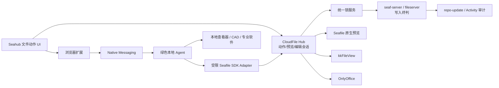
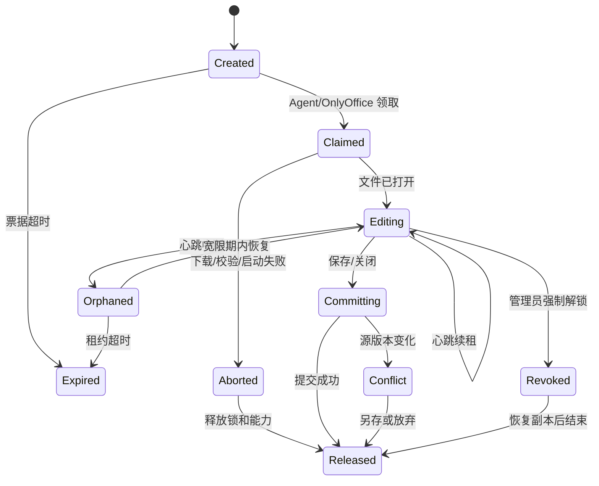

# 文件预览、在线协作与本地专业编辑

CloudFile（Seafile CE 企业扩展版）的文件交互规格。本文覆盖原生预览、kkFileView、
OnlyOffice、浏览器扩展和绿色本地 Agent，并定义它们共同依赖的锁、会话、权限与审计语义。

配套文档：

- [FEATURES.md](FEATURES.md)：特性状态和排期
- [BRANCHES.md](BRANCHES.md)：耦合簇与分支边界
- [EXTENSION-POINTS.md](EXTENSION-POINTS.md)：现有扩展点及缺口
- [audit.md](audit.md)：操作审计数据来源
- [acl-semantics.md](acl-semantics.md)：目录权限终判

> 状态：方案评审稿。**P0.5（统一写入生命周期扩展点）已实现**，见下方第十三节
> 与 [fileop-lifecycle.md](fileop-lifecycle.md)；P1 及之后尚未开工。
>
> 结论：把能力定义为统一的“文件动作平台”，而不是把
> `etech-seafile` 的浏览器插件和 Go Bridge 原样搬进 CloudFile。
> 现有项目可复用编辑器探测、工作区、关联文件和延迟上传思路；认证、传输、
> 锁和浏览器联动必须按本文重新设计。

---

## 一、最佳实践审查结论

### 1.1 保留的决策

1. **预览与编辑严格分离。** 预览永不获取写锁；本地查看即使产生本地修改也不上传。
2. **OnlyOffice 与本地专业编辑分工。** OnlyOffice 负责 Office 在线协作，
   本地 Agent 负责 CAD、设计文件和专业软件。
3. **浏览器扩展只做终端桥接。** 它不判断权限、不抓 Cookie、不持有 Seafile Token，
   也不向页面注入业务规则。
4. **绿色 Agent 不要求 Seafile Client。** 它只处理一次编辑会话，不维护整库同步状态。
5. **所有写入入口共享锁终判。** Web、REST、WebDAV、同步客户端、OnlyOffice 和
   本地 Agent 不能各自实现一套锁。

### 1.2 修订的决策

| 原设想 | 审查后决策 | 理由 |
|---|---|---|
| 固定超时后自动解锁 | 软租约 + 心跳 + 宽限期 + 最长时限 | 固定超时会在仍编辑时释放；无超时则永久僵尸锁 |
| 有锁即可安全提交 | 锁 + 源版本比较 + fencing generation | 锁被强制释放后，旧 Agent 仍可能重新联网写回 |
| 直接复用 `FileLocks.id` 做 fencing | `cf_lock_lease` 自己持有锁真值和 UUID generation；`FileLocks` 仅作 CE→Pro 停机迁移目标 | CE 没有锁实现；客户端走 HTTP/通知而非读服务端表，运行期双写只会制造双真值 |
| 本地 Agent 保存 API Token | 一次性启动票据换单文件能力 | 长期 Token 泄露后的影响范围过大 |
| 页面直接访问 localhost HTTP | 浏览器 Native Messaging | 避免开放 CORS、端口冲突、任意网页调用本地服务 |
| 浏览器插件扫描 DOM 插按钮 | 前端文件动作注册中心 | DOM 结构随上游变化，无法成为长期扩展点 |
| kkFileView 直接拿下载链接 | Hub 内容网关 + 内部服务凭据 | 防止链接泄露、SSRF 和越权复用 |
| 所有 CAD 依赖都自动递归发现 | 可插拔 Workspace Resolver | CAD/PDM 依赖不是靠扩展名或目录递归就能可靠推断 |
| 严格拒绝所有含锁父目录操作 | 默认采用 Pro 兼容语义，严格模式仅为可选策略 | Pro 允许同库父目录移动/重命名并保持锁，也允许删除父目录 |
| 让 CE 对客户端宣称 `is_pro=true` | 发布独立 `file-lock-v1` capability | 桌面客户端以 Pro 标志门控锁，但伪装版本会误启用其他 Pro 假设 |

### 1.3 不变量

实现和验收必须保持以下不变量：

1. `CF_ENABLE_*` 全关时，原生 CE 行为不变。
2. “可预览”不蕴含“可下载”，“可查看”不蕴含“可编辑”。
3. 锁不能放宽 ACL 或库级权限；权限被收回后，持锁者也不能提交。
4. 没有有效锁、会话、generation 和源版本中的任意一个，编辑提交都不能成功。
5. 服务端返回的是 `tool_id` 和能力，不是可执行文件路径或任意命令行。
6. 浏览器、kkFileView、OnlyOffice 和本地 Agent 都不接触用户密码。
7. 预览和编辑票据都是短期、单对象、单用途的，不能互相升级。
8. 强制解锁后，旧会话只能恢复或另存为冲突副本，不能覆盖当前文件。
9. CloudFile 锁后端与原生 Pro 锁后端互斥启用，任何进程不得同时注册两个锁真值。
10. Pro 兼容接口保持公开行为一致；CloudFile 的 generation、设备和审计字段只能向后扩展，
    不能改变既有客户端理解的 `is_locked`、`lock_owner`、`by_me` 和过期语义。

---

## 二、产品能力模型

### 2.1 文件动作

服务端按当前用户、文件、部署配置和终端能力返回动作集合：

| 动作 | 模式 | 是否写锁 | 是否写回 | 典型格式 |
|---|---|---:|---:|---|
| Seafile 原生预览 | `native-preview` | 否 | 否 | PDF、图片、文本、音视频、Markdown |
| kkFileView 预览 | `kk-preview` | 否 | 否 | Office、CAD、3D、压缩包、长尾格式 |
| OnlyOffice 查看 | `onlyoffice-view` | 否 | 否 | Office |
| 本地软件查看 | `local-view` | 否 | 否 | CAD、设计文件、专业格式 |
| OnlyOffice 编辑 | `onlyoffice-edit` | 服务会话锁 | 是 | DOCX、XLSX、PPTX |
| 本地软件编辑 | `local-edit` | 排他锁 | 是 | DWG、PRT、ASM 等 |
| 手工签出 | `checkout` | 排他锁 | 是 | 长时间独占工作 |

下载是独立动作，不属于预览 provider。不能因为 kkFileView 或本地查看需要读取文件，
就把下载权限暴露给用户。

### 2.2 动作解析

动作解析至少考虑：

- 当前有效权限：预览、下载、在线编辑、写入
- 文件扩展名、MIME、大小、加密库状态
- 当前锁及其持有人
- 功能开关与 provider 路由
- OnlyOffice / kkFileView 服务健康
- 本地 Agent 是否在线及其工具清单
- 管理员对库、目录、文件类型和密级的策略

前端不得自行维护“哪些扩展名能编辑”的第二份清单。建议提供：

```text
GET /api/v2.1/cloudfile/file-actions/?repo_id=<id>&path=<path>
```

响应包含稳定的 action id、模式、是否可用、不可用原因和所需客户端能力。前端只展示，
真正执行动作时服务端重新鉴权，避免动作列表过期导致越权。

对象边界必须在动作解析时显式返回：

- 外部源不进入 repo/commit/block 模型，`local-edit`、`checkout` 和文件锁结构上不可用；
  `file-actions` 返回稳定原因 `external_source_not_writable`，不能只隐藏按钮。
- 加密库首版只保留上游已经支持的原生动作。kkFileView、OnlyOffice、本地查看和本地编辑
  默认返回 `encrypted_repo_unsupported`；只有后续证明端到端明文不落盘、票据和密钥边界
  均安全后，才按 provider 单独开放。

### 2.3 默认路由

建议默认优先级：

1. 原生预览能完整支持的格式，优先原生。
2. 原生不支持或管理员明确指定的格式，使用 kkFileView。
3. Office 在线编辑优先 OnlyOffice。
4. CAD、设计文件和专业软件格式优先本地 Agent。
5. 同一文件可以有多个“打开方式”，但默认动作只能有一个。
6. provider 不健康时只降级到管理员允许的只读动作，不静默切换编辑器。

---

## 三、总体架构



### 3.1 控制面与数据面

**控制面**由 Hub 负责：

- 动作解析
- 权限和策略判断
- 创建预览/编辑会话
- 加锁、续租、释放和强制解锁
- 签发一次性票据
- 管理 Agent、工具和会话状态

**数据面**由 fileserver/内部内容网关负责：

- 文件内容下载
- 编辑结果上传
- 大文件分块与校验
- 写入前的锁、generation、权限和源版本终判

Agent 可以封装 Seafile SDK，但只使用当前会话的受限能力；它不保存账号级 Token，
也不承担后台整库同步。

---

## 四、完整锁语义

### 4.1 锁类型

| 类型 | 持有人 | 续租者 | 并发语义 |
|---|---|---|---|
| `pro-compatible` | 用户；服务端不区分桌面手工/Office 自动锁 | 用户/Web/桌面客户端 | 与 Pro 相同的排他语义 |
| `checkout` | 用户/流程 | 流程/用户 | 排他 |
| `local-edit` | 用户 + 设备 + Agent 会话 | Agent | 排他 |
| `onlyoffice` | OnlyOffice 文档会话 | Hub/回调 | 会话内协作、会话外排他 |

OnlyOffice 的多个参与者共享一个服务会话锁，不为每个参与者创建互斥锁。

### 4.2 数据模型

本能力的数据库基线只包括 compose 使用的 MySQL/MariaDB，不设计其他数据库方言。
生产库里的上游表结构为：

```text
FileLocks: id, repo_id, path, user_name, lock_time, expire
```

CE 只有 `seafile-rpc.h` 声明和 DDL：没有 lock manager、RPC 实现/注册、Python
`lock_file`/`unlock_file` 绑定或写路径终判；`check_file_lock()` 明确恒返回 0。因此
`FileLocks` 不是可复用的锁真值，表主键也不应被提升为安全协议字段。项目固定的
MariaDB 11.4 InnoDB 自增计数器会跨重启持久化，不能用“普通重启必然复用 id”作为反对
理由；真正风险是 fencing 正确性会被绑定到迁移目标表的保留、备份恢复、表重建/重置和
未来迁移策略。独立 generation 让这些存储生命周期操作都不改变会话安全语义。

`cf_lock_lease` 是唯一权威锁表：

| 字段 | 说明 |
|---|---|
| `lock_id` | CloudFile 自有 UUID，主键，与 `FileLocks` 无外键关系 |
| `repo_id/normalized_path` | 锁对象；建立唯一约束，路径使用统一规范化规则 |
| `generation` | 每次成功获取锁都生成新的 UUID，唯一且非空，只比较相等性、不解释顺序 |
| `kind` | pro-compatible / checkout / local-edit / onlyoffice |
| `session_id` | 编辑或签出会话 |
| `owner` | 用户或服务会话身份 |
| `device_id` | 本地编辑终端 |
| `source_file_id` | 开始编辑时内容对象 ID |
| `source_commit_id` | 开始编辑时库版本 |
| `lease_until` | 当前软租约到期 |
| `hard_expire_at` | 最长持锁时间 |
| `last_heartbeat_at` | 最近心跳 |
| `status` | active / orphaned / revoked / released / expired |
| `forced_by` | 强制解锁操作者 |
| `forced_reason` | 强制解锁原因 |
| `created_at/updated_at` | 审计时间 |

UUID generation 由应用生成，不依赖行号、自增器或数据库进程状态。强制解锁后重新加锁
必须生成新值；旧会话只要携带旧 generation，就在任何数据库重启前后都被拒绝。

开源桌面客户端已确认不读取服务端 `FileLocks`：它消费 locked-files HTTP、lock/unlock
HTTP 和通知，并在本地维护 `filelocks.db`。因此 CE 运行期**不写 `FileLocks`**；
`FileLocks` 只在停写迁移到 Pro 时由一次性工具生成。锁列表 UI、客户端协议和终判都直接
读取 `cf_lock_lease`。另建 `cf_lock_repo_revision(repo_id, revision)`；当锁状态变化
会改变客户端可见集合、owner 或 path 时，与 lease 同事务递增，用于轮询和缓存失效；
仅 refresh 到期时间不推进客户端 revision。

| `cf_lock_repo_revision` 字段 | 说明 |
|---|---|
| `repo_id` | 主键；虚拟库变化计入 origin repo |
| `revision` | BIGINT 单调递增；客户端只当 opaque `ts` 回传 |
| `updated_at` | 运维与对账时间，不参与顺序判断 |

新增 `cf_edit_session`：

| 字段 | 说明 |
|---|---|
| `session_id` | 会话 ID |
| `mode` | onlyoffice-edit / local-edit / local-view |
| `username` | Seafile 身份，不存登录邮箱 |
| `repo_id/path` | 当前对象 |
| `lock_id/generation` | 编辑模式对应锁和 fencing 值；查看模式为空 |
| `tool_id` | OnlyOffice 或本地工具 |
| `base_file_id/base_commit_id` | 乐观并发基线 |
| `ticket_digest` | 一次性票据摘要，不存明文 |
| `ticket_expire_at` | 票据领取期限 |
| `state` | 状态机 |
| `created_at/claimed_at/closed_at` | 生命周期时间 |

`cf_*` 表仍落在 seafile-db，生产 DDL 放在
`cloudfile-server/scripts/sql/mysql/cloudfile.sql`，并以真实 MariaDB 执行作为门禁。

### 4.3 状态机



### 4.4 租约和超时

推荐默认值，最终以现场使用时长压测后调整：

| 配置 | 建议值 | 说明 |
|---|---:|---|
| Pro 兼容锁默认期限 | 12 小时 | 对齐 `[file_lock] default_expire_hours`；`expire=0` 使用此值 |
| OnlineOffice 锁期限 | 40 分钟 | 对齐 Seahub 既有 WOPI/OnlyOffice 调用，活动时 refresh |
| 活跃租约 | 30 分钟 | 每次心跳向后延长 |
| 心跳间隔 | 5 分钟 | 小于租约的三分之一 |
| 网络宽限 | 10 分钟 | 心跳失败后先进入 orphaned |
| 本地编辑最长时限 | 24 小时 | 防止长期僵尸锁 |
| 手工签出最长时限 | 72 小时 | 可按流程调整 |
| 启动票据有效期 | 60 秒 | 只用于 Agent 领取 |
| 提交能力有效期 | 不长于当前租约 | 锁失效即不可用 |

Pro 兼容入口必须保留三态：`expire=0` 使用默认期限；正数在 REST 层表示持续秒数并在
调用锁后端前换成绝对时间；负数表示冻结、不自动过期。CloudFile 管理的
`local-edit`、`checkout` 和 `onlyoffice` 仍使用心跳租约及 hard expiry，不能把冻结语义
扩散到 Agent 会话。

租约是否过期必须在读取时判断，不能只依赖周期清理任务。唯一终判字段是
`cf_lock_lease.lease_until`；周期任务负责标记/清理陈旧行，不负责决定请求
能否放行。首个观察到过期的请求以条件更新把 active 转为 expired、推进 repo revision；
并发请求和清理任务必须幂等，通知只在成功完成该状态迁移的一方提交后发送。

### 4.5 获取锁

获取锁必须是一个事务：

1. 规范化 repo/path，并取得数据库事务锁。
2. 重新检查用户当前写权限。
3. 先以 `INSERT ... ON DUPLICATE KEY UPDATE` 确保对象键行存在，再用
   `SELECT ... FOR UPDATE` 锁定它；不能依赖对不存在行加锁。
4. 查询现有租约；存在有效锁则返回 `423 Locked`。
5. 对已过期/已释放对象写入新的 `lock_id` 和随机 UUID generation，禁止沿用旧值。
6. 写入 `cf_edit_session`，并递增对应库的 `cf_lock_repo_revision`。
7. 提交后才返回启动票据。

CAD 工作区的多文件锁必须“全取或全不取”。按规范路径排序后锁定，避免两个会话以不同
顺序取得部分锁而死锁。

### 4.6 写入终判

每次提交必须同时满足：

1. 用户仍有写权限。
2. 编辑会话为可提交状态。
3. `cf_lock_lease.generation == session.generation`。
4. 权威租约未过期、未撤销，且属于当前用户/服务会话。
5. 当前文件 ID/commit 与会话基线一致。
6. 上传内容通过大小、类型、病毒扫描等已有规则。

建议状态码：

| 状态 | HTTP | 客户端行为 |
|---|---:|---|
| 被其他会话锁定 | 423 | 显示持有人和剩余时间 |
| 基线版本变化 | 409 | 合并、另存冲突副本或放弃 |
| 会话/票据过期 | 410 | 保留本地文件，重新建会话 |
| 权限被收回 | 403 | 禁止写回，允许导出本地副本 |
| 服务暂不可用 | 503 | 保留待提交队列，不释放本地副本 |

### 4.7 强制解锁

权限角色：

- 锁持有人可以释放自己的锁。
- 库管理员可以强制释放本库锁。
- 系统管理员和专门的锁管理员可以跨库操作。
- OnlyOffice/Agent 只能释放自身 session 的锁。

强制解锁必须：

1. 要求原因，记录操作者、时间、原持有人和 session。
2. 将会话和权威租约置为 `revoked`，并递增对应库的锁 revision。
3. 发送通知给持有人。
4. 产生审计事件。
5. 使旧 generation 永久不可提交。

强制解锁不是“丢弃他人修改”。Agent 要保留工作区，并提供“重新申请锁”“另存到
Seafile”“导出到本地”三个恢复选项。

### 4.8 路径变化与严格模式

锁至少阻止其他用户对目标文件执行：

- 更新、覆盖
- 删除
- 移动、重命名
- 恢复旧版本

默认必须采用 Pro 兼容模式：

- 其他用户不能直接更新、移动、重命名或删除锁定文件。
- 同一库内移动/重命名父目录允许，并在提交文件树变更的同一锁事务中重写所有后代
  `normalized_path`；`lock_id`、generation、owner 和到期时间保持不变。
- 删除父目录允许，但必须把后代锁置为 revoked、撤销编辑能力并通知会话；旧写回因
  generation/源版本失效而拒绝。普通桌面同步仍按下节的 Pro 兼容通道处理。
- 跨库移动含锁子树默认拒绝，因为不能把锁与文件提交做成跨库原子事务。

可选 `strict` 模式才拒绝所有含锁父目录操作，但这属于 CloudFile 增强策略，不能伪装成
Pro 默认。子树判断复用目录 ACL 已验证的规范路径、前缀包含语义和共享用例集，不再实现
第二套遍历算法。但不能直接把锁 provider 注册成现有 `CfRestrictedFunc`：该接口表达
“用户不可达路径”，并被同步/打包下载调用；混入锁会错误阻止只读操作。

### 4.9 Pro 行为与协议兼容

Pro server 源码不在当前三个仓库中，不能声称内部实现逐行一致。兼容基线取自三类可验证
事实：CE Seahub 中保留的 Pro 调用契约、开源桌面客户端实际消费的 HTTP/通知协议，以及
官方用户/管理文档。落地前仍需用同一黑盒用例对授权的 Pro 14 环境和 CloudFile 各跑一次。
源码证据集中在 `cloudfile-hub/seahub/utils/file_op.py`、`api2/endpoints/file.py`、
`wopi/views.py`，以及桌面客户端 `seafile/daemon/http-tx-mgr.c`、`sync-mgr.c`、
`filelock-mgr.c`、`notif-mgr.c`。

必须保持的兼容面：

| 兼容面 | Pro/客户端既有行为 | CloudFile 实现约束 |
|---|---|---|
| `check_file_lock` | `0` 未锁、`1` 他人、`2` 自己、`-1` 错误 | Hub adapter 返回相同四态；内部错误不得伪装成未锁 |
| owner | 普通用户或特殊值 `OnlineOffice` | 保留原值用于列表/WOPI；另存规范 actor 字段，不改公开 owner |
| 过期 | 默认 12 小时；`0` 默认、正数指定、负数冻结 | REST duration 与内部绝对时间明确转换；冻结仅限兼容锁 |
| refresh | 仅持有人或 `OnlineOffice` 可续期 | 保持权限；管理员强制解锁走独立审计接口 |
| 解锁 | 持有人可解；库 owner/admin 可强制解 | 保持，并额外要求强制解锁原因和通知 |
| 文件列表 | `is_locked`、`lock_owner`、`locked_by_me` | C 目录列举直接从权威 lease 填充，不要求 `FileLocks` 成为真值 |
| 虚拟库 | 同一底层文件只有一把锁 | 获取锁前把虚拟 repo/path 解析为 origin repo/path，响应再映射到请求视图 |
| 父目录 | 同库移动/重命名后锁仍存在；父目录删除允许 | 原子改写路径或撤销后代锁；默认不使用 strict |
| 桌面轮询 | `POST /repo/locked-files`，请求含 `repo_id/token/ts` | 返回 `repo_id/ts/locked_files[{path,by_me}]`，`ts` 是不回退的每库 revision |
| 桌面操作 | `PUT /repo/{repo_id}/lock-file?p=...` 和 `unlock-file` | 认证、路径编码与成功状态保持兼容；冲突响应纳入黑盒金样 |
| 实时通知 | `file-lock-changed`：repo/path/event/lock_user | acquire/release/expire/force-release/路径迁移提交后发；refresh 不制造状态通知 |

轮询 revision 的权威值来自 `cf_lock_repo_revision`，不在 CE 运行期双写
`FileLockTimestamp`。轮询返回的是当前完整锁集合；缓存只能优化读取，失效或不可用时
必须回源权威 lease，不能 fail-open。迁移 Pro 时才把 revision 导出到
`FileLockTimestamp`。

#### 两条写入安全通道

原生桌面客户端的同步提交不携带 session/generation，因此“完全保持 Pro 协议”和“所有
写入都强制 generation”不能同时成立。规格明确拆成两条通道，共享同一把锁：

1. **Pro 兼容通道**：普通 Web/REST/桌面同步。无锁时按原生权限写；有锁时只允许当前
   owner 写。它不承诺强制解锁后、路径再次处于无锁状态时识别旧客户端写回——这与 Pro
   一致，不能虚构客户端未发送的 fencing token。
2. **CloudFile 会话通道**：OnlyOffice、本地 Agent、checkout。除 owner 外必须携带
   session + generation + source version；强制解锁后旧会话永久失效。

当前锁若属于 CloudFile 会话，即使请求用户名与 owner 相同，没有正确 generation 也必须
拒绝；当前锁若属于 `pro-compatible`，同 owner 的原生提交可通过。两类锁仍受同一个
`UNIQUE(repo_id, normalized_path)` 约束，绝不能各建一把。

#### 后端隔离与升级

内部接口使用 `LockBackend`，实现为 `CloudFileLockBackend` 或 `ProLockBackend`。CE 的
RPC 使用 `cf_lock_*` 命名，Hub 通过 adapter 调用；不要猴子补丁
`seafile_api.lock_file`，也不要抢占 Pro 的 RPC 名称。公开 REST/fileserver 协议可以兼容，
内部符号和数据表必须隔离。

- `CF_LOCK_BACKEND=cloudfile|pro` 必须单选；Pro 进程检测到 `cloudfile` 或 CE 进程检测到
  `pro` 时启动失败。
- `CF_ENABLE_FILE_LOCK=false` 时两个 backend 都不注册。
- 不把 CE 全局伪装成 `is_pro=true`。在既有 `/api2/server-info/` 的 `features` 数组新增
  `file-lock-v1`；CloudFile 客户端/Agent 按该 capability 启用。未修改的官方桌面客户端
  仍以本地 `is_pro` property 门控锁功能，只能安全降级为服务端阻止写入，不能承诺锁图标
  和本地只读状态。
- 客户端补丁新增独立 `has_file_lock` server property，只替换
  `sync-mgr.c`/`repo-mgr.c`/`notif-mgr.c` 的锁相关 `server_is_pro()` 判断；目录权限和
  其他 Pro 分支继续读 `is_pro`，防止 capability 越界。

CE 升级 Pro 使用停写迁移，不做在线双写：

1. preflight 确认 Pro 目标表无活动锁、版本和 DDL 匹配，随后关闭所有写入口。
2. 要求 Agent/OnlyOffice/checkout 保存或退出；剩余 generation 会话全部 revoke，
   不得静默降级为普通 Pro 锁。
3. 在单个数据库事务中把仍有效的 `pro-compatible` 用户锁导入 `FileLocks`，把当前
   revision 写入 `FileLockTimestamp`，并保存可审计迁移 manifest。
4. 关闭 `CloudFileLockBackend`，切换镜像和 `CF_LOCK_BACKEND=pro`；任何一步失败都在
   重新开放写入前回滚。
5. 用 Pro 的 check/list/lock/unlock/父目录金样验证后才解除停写。Pro 一旦接受新写入，
   不允许直接回滚旧 backend，必须执行反向停写迁移。

---

## 五、预览体系

### 5.1 Preview Router

预览是“多个 provider 可用、一个默认 provider 生效”的路由问题。建议注册：

```text
native
kkfileview
onlyoffice-view
local-view
```

每个 provider 声明：

- 支持的扩展名/MIME
- 最大文件大小
- 是否支持加密库
- 是否支持水印、打印、下载控制
- 所需外部服务或终端工具
- 健康状态

管理员配置按文件类型的默认路由，例如：

```text
pdf,image,text,markdown -> native
doc,docx,xls,xlsx,ppt,pptx -> onlyoffice-view
dwg,dxf,step,iges,stl,ifc -> kkfileview
prt,asm,catpart -> local-view
```

路由配置只决定默认打开方式，不能扩大用户权限。

### 5.2 Seafile 原生预览

原生能稳定处理的格式优先复用，不为统一接口而重新代理所有内容。CloudFile 只在动作
解析层描述它，不复制原生渲染逻辑。

原生预览仍必须继承：

- 当前登录态和 ACL
- 不可下载权限
- 文件历史/快照只读语义
- 加密库限制
- 审计策略

### 5.3 kkFileView 集成

kkFileView 支持 Office、PDF、CAD、3D、压缩包、图片、音视频等格式，也支持通过
HTTP/HTTPS 流读取文件，适合作为长尾预览 provider。

安全边界：

1. kkFileView 只部署在内部网络，不直接暴露公网端口。
2. 它只能访问 CloudFile 内容网关；网络层拒绝访问 metadata IP、localhost、
   内网其他服务和任意外部主机。
3. 开启 trusted host，且仍保留容器 egress allow-list；应用配置不能替代网络隔离。
4. 不向 kkFileView 传用户 Cookie、API Token或永久下载 URL。
5. Hub 签发单文件、单版本、短时内容票据，内容网关验证服务身份和票据。
6. kkFileView 页面经 Hub 反向代理，用户不能绕过 Hub 直接访问缓存。
7. 源文件、转换结果和临时目录按 TTL 清理，容器设 CPU、内存、磁盘和转换超时。
8. 固定经过安全评审的版本；升级前跑恶意文件和回归样本。

缓存键建议：

```text
repo_id + file_id + renderer_version + render_options_hash
```

缓存键不能包含临时票据。文件 ID 变化自然产生新缓存，旧缓存由 TTL 清理。

缓存只复用转换产物，不能复用访问结论。`cf_dir_acl` 按路径判权，因此同一内容可能同时
出现在 `/public/a.docx` 和 `/secret/a.docx`。Hub 每次返回缓存前都必须用当前用户、
`repo_id` 和请求的 `normalized_path` 重新鉴权；只凭 `file_id` 或缓存命中放行会造成
跨路径越权。缓存记录应保留源版本和渲染参数，但权限不进入长期缓存。

kkFileView 当前采用 Apache-2.0，分发时保留 LICENSE/NOTICE；依赖的 LibreOffice、
字体和转换工具仍需单独核对许可证。

### 5.4 下载、打印和水印

预览 UI 的下载按钮不是安全边界。若用户无下载权限：

- kkFileView 禁用下载、源文件和打印入口。
- 内容票据只能由 kkFileView 服务身份使用。
- Hub 不向浏览器返回源文件 URL。
- 对截图无法技术上完全阻断，应通过动态水印和审计降低泄露风险。

水印内容可包括用户名、时间和组织，但不得把敏感身份放入可长期缓存的转换文件。
动态水印优先在用户响应层叠加。

### 5.5 本地软件查看

`local-view`：

- 不加锁。
- 只签发下载能力，不签发提交能力。
- Agent 创建独立、只读工作区。
- Agent 不监听上传；应用即使修改副本也不写回。
- 关闭后按策略清理；敏感文件禁止离线缓存。

只读文件属性只能减少误操作，不能作为服务端安全边界。真正的保证是会话没有上传能力。

---

## 六、OnlyOffice 在线协作

### 6.1 复用边界

Seafile CE 已包含 OnlyOffice 的视图、配置、下载、上传和回调链路。CloudFile 不重写
编辑器集成，只补：

- 把 CE 中指向不存在锁 API 的 Pro 分支替换为 P1 统一锁服务
- callback 幂等
- force-save/自动保存
- 状态和故障可见性

不要修改全局 `is_pro_version()`，也不能简单解除原有门控，否则会调用 CE 中不存在的
`seafile_api.lock_file`。优先用 CloudFile 自有 URL 影子或最小扩展钩子接入 P1 API。

### 6.2 协作锁

第一次进入编辑时创建 `onlyoffice` 服务锁。同一 `document_key` 的参与者加入该会话，
不会互相排斥；会话之外的本地编辑、同步覆盖和普通更新被阻止。

本地编辑锁已存在时：

- OnlyOffice 编辑拒绝。
- OnlyOffice 查看可以允许。

OnlyOffice 编辑锁已存在时：

- 本地编辑拒绝。
- 本地查看和 kkFileView 预览可以允许。

### 6.3 保存和回调

1. 开启 JWT，且 Seafile 与 Document Server 使用同一有效 secret。
2. 开启 force-save，并配置周期自动保存。
3. callback 以 `document_key + status + source_version` 幂等。
4. 回调写入仍执行 generation、权限和源版本校验。
5. Document Server 获取内容也使用受限内部 URL，不使用用户 Cookie。
6. 回调成功更新会话基线；最终关闭才释放服务锁。
7. Document Server 故障时保留会话和锁至宽限期，不立即允许第二编辑器覆盖。

### 6.4 容量与许可证

ONLYOFFICE Docs Community Edition 为 AGPLv3，当前官方说明免费 Community 版有
20 个同时编辑连接限制。部署前必须：

- 估算峰值编辑连接，而不是只估账号数。
- 确认 AGPL 源码提供和修改披露义务。
- 超过免费版限制或需要集群/SLA 时评估商业版本。
- 独立设置 CPU、内存、队列、持久化目录和健康检查。

---

## 七、绿色本地 Agent

### 7.1 为什么不复用 Seafile Client

目标环境可能没有管理员权限，也不允许安装同步客户端。绿色 Agent：

- 不创建完整同步工作区。
- 不维护库级 commit/block 缓存。
- 不后台扫描用户目录。
- 不保存账号密码或长期 Token。
- 一次只处理服务端批准的查看/编辑会话。

因此它不是另一个 Seafile Client，而是受限的“打开与提交”终端。

### 7.2 组件

```text
cloudfile-local-agent
├── native-host        浏览器 Native Messaging
├── session-client     领取票据、心跳、关闭会话
├── seafile-adapter    受限下载/上传、分块和校验
├── workspace-manager  会话目录、恢复、清理
├── tool-registry      本地软件探测和 tool_id 解析
├── process-monitor    启动与监控查看器/编辑器
├── change-tracker     稳定写入检测和变更集
├── package-verifier   绿色软件包签名校验
└── tray-ui            会话、冲突、恢复和日志
```

### 7.3 Native Messaging

推荐通道：

```text
Seahub 页面 -> 扩展 content script -> extension service worker
             -> Native Messaging -> Agent
```

Windows 绿色模式：

- 压缩包解压到用户目录。
- 首次运行写当前用户 `HKCU` Native Messaging Host 注册。
- manifest 的 `allowed_origins` 精确到正式扩展 ID，不允许通配符。
- 浏览器按需启动 Agent，不要求 Windows Service 或常驻端口。

如果企业策略禁止 HKCU Native Messaging，可提供手动启动降级模式，但自动唤起不是
必达能力。不要退回无鉴权、`Access-Control-Allow-Origin: *` 的 localhost HTTP。

### 7.4 浏览器扩展权限

扩展只需要：

- `nativeMessaging`
- 当前 CloudFile 站点的最小 host permission
- 必要时 `activeTab`

不需要：

- `cookies`
- `webRequest`
- 任意站点通配符
- 读取 localStorage 中的认证信息

扩展收到的是一次性票据，不是 Cookie、CSRF 或 Seafile API Token。

### 7.5 启动票据

票据要求：

- 至少 128 bit 随机性
- 数据库只保存摘要
- 60 秒内领取
- 单次使用
- 绑定会话、用户、站点和动作
- 领取后立刻失效

Agent 领取票据后获得：

- `session_id`
- 允许的 mode
- `tool_id`
- 文件/工作区清单
- 当前 generation
- 短期下载和提交能力
- 心跳周期

票据本身不包含 repo/path、文件名、服务器 Token 或可执行命令。

### 7.6 本地工作区

目录结构：

```text
CloudFileLocal/
├── sessions/<session-id>/
│   ├── workspace/
│   ├── session.json
│   ├── changes.json
│   └── recovery/
├── tools/
├── cache/
└── logs/
```

规则：

- 每个会话独立目录，避免同名文件覆盖。
- 服务端路径经过规范化后再映射，拒绝 `..`、绝对路径、设备路径和符号链接逃逸。
- `session.json` 不保存票据和上传能力明文。
- 日志脱敏，不记录文件内容、Cookie、Token 和完整下载 URL。
- 上传成功前不删除本地修改。
- 清理按会话状态和敏感级别执行。

### 7.7 工具注册与绿色软件包

服务端只返回稳定 `tool_id`，例如：

```text
autocad.installed
dwg.viewer.portable
nx.installed
office.onlyoffice
generic.readonly
```

Agent 本地 manifest 决定：

- 可执行文件位置
- 支持的扩展名
- view/edit 能力
- 参数模板
- 版本和架构
- 是否需要许可证

服务端不能发送任意 executable、shell、PowerShell 或命令行模板，否则文件打开能力会
变成远程代码执行平台。

绿色软件包至少包含：

```text
manifest.json
payload/
LICENSES/
signature
checksums.sha256
```

签名覆盖 manifest 和全部 payload。升级采用“下载到新目录 -> 校验 -> 原子切换 ->
保留上一版”，失败可回滚。商业 CAD 软件只做本地探测，不由 CloudFile 分发。

### 7.8 查看流程

1. 页面创建 `local-view` 会话。
2. Hub 校验预览权限并签发票据，不加锁。
3. 扩展通过 Native Messaging 唤起 Agent。
4. Agent 领取只读内容能力。
5. Agent 打开只读工作区。
6. 关闭后清理；任何本地变化都不上传。

### 7.9 编辑流程

1. 页面创建 `local-edit` 会话。
2. Hub 事务内校验权限、获取锁并记录源版本。
3. 扩展通过 Native Messaging 发送一次性票据。
4. Agent 领取会话，下载文件/工作区并校验摘要。
5. Agent 启动本地软件并周期心跳。
6. change tracker 等待文件稳定，不在每个 fsnotify 事件后立即上传。
7. Agent 提交 generation、基线版本和变更集。
8. Server 终判后写入 Seafile，产生新版本和审计。
9. Agent 收到成功确认后释放锁并按策略清理。

若第 4 步下载/校验失败或第 5 步工具启动失败，Agent 必须调用 `abort`；Hub 将
`Claimed -> Aborted -> Released` 并立即撤销能力、释放租约。Agent 在 claim 后崩溃时，
服务端在领取宽限期后执行同一自动 abort，不能让尚未进入 Editing 的会话占锁到最长时限。

“文件稳定”不是“编辑完成”。默认应在应用退出或用户明确提交时写回；自动保存可作为
可配置模式，并设置最短间隔、哈希去重和正在写入检测。

### 7.10 网络中断

- 宽限期内继续编辑并重试心跳。
- 超过宽限期后标记 at-risk，提示锁可能失效。
- Agent 不得自行假设仍持锁。
- 恢复网络后先查询 generation 和源版本。
- generation 变化时禁止覆盖，只能重新加锁并合并/另存。
- 本地恢复文件在用户确认前不自动删除。

---

## 八、CAD 与多文件工作区

### 8.1 不能承诺“通用自动依赖发现”

DWG 外部参照、UG/SolidWorks 装配、贴图、字体和 PDM 关系的表达各不相同。文件夹递归
既会漏依赖，也可能把无关或无权限文件下载到本地。

### 8.2 Workspace Resolver

定义 provider：

| resolver | 用途 |
|---|---|
| `single-file` | MVP，只处理当前文件 |
| `selected-folder` | 用户显式选择受控目录 |
| `manifest` | 使用项目/BOM/PDM 清单 |
| `cad-plugin:<type>` | 专业解析器读取格式依赖 |

resolver 输出：

- 根文件
- 依赖文件及相对路径
- 必需/可选关系
- 每个文件的权限
- 需要编辑锁或只读下载
- 最大文件数和总大小

### 8.3 多文件提交

1. 先解析清单并逐项鉴权。
2. 对所有可编辑文件原子获取锁。
3. 只读依赖不加写锁，但提交时不得上传。
4. 下载后生成基线 manifest。
5. 只上传哈希变化的可编辑文件。
6. 任一 generation 或源版本变化，整批提交停止。
7. 服务端事务不能跨多个 Seafile commit 时，先上传临时对象，再一次提交引用；
   失败时清理临时对象。

首版范围应明确为 `single-file`，多文件装配在锁、会话和恢复机制稳定后交付。

---

## 九、安全威胁模型

| 威胁 | 控制 |
|---|---|
| 恶意网页调用本地 Agent | Native Messaging + 精确 `allowed_origins` |
| 扩展窃取 Seahub 会话 | 不申请 cookies/webRequest，不传浏览器凭据 |
| 启动票据泄露 | 短时、单用、摘要存储、领取即失效 |
| Agent Token 泄露 | 会话级、单文件、短期能力；不存用户 Token |
| 强制解锁后的旧写回 | `cf_lock_lease` 独立 UUID generation + 当前值精确匹配 |
| 两人同时编辑覆盖 | 排他锁 + 源版本 CAS |
| kkFileView SSRF | trusted host + egress allow-list + 内部内容网关 |
| kkFileView 缓存越权 | Hub 鉴权代理，缓存键不含票据 |
| 服务端下发恶意命令 | 只下发 `tool_id`，命令由签名本地 manifest 定义 |
| 绿色包被替换 | 数字签名、hash、原子升级、回滚 |
| CAD 路径穿越 | 路径规范化、会话沙箱、拒绝链接逃逸 |
| 临时文件泄露 | 用户隔离、权限、TTL、敏感文件禁缓存 |
| 管理员滥用强制解锁 | 角色限制、必填原因、审计和通知 |
| 日志泄露 | Token/URL/路径分级脱敏 |

---

## 十、API 边界

建议自有路由：

```text
GET    /api/v2.1/cloudfile/file-actions/
POST   /api/v2.1/cloudfile/preview-sessions/
POST   /api/v2.1/cloudfile/edit-sessions/
POST   /api/v2.1/cloudfile/edit-sessions/<id>/claim/
POST   /api/v2.1/cloudfile/edit-sessions/<id>/heartbeat/
POST   /api/v2.1/cloudfile/edit-sessions/<id>/commit/
POST   /api/v2.1/cloudfile/edit-sessions/<id>/abort/
GET    /api/v2.1/cloudfile/locks/
POST   /api/v2.1/cloudfile/locks/
DELETE /api/v2.1/cloudfile/locks/<id>/
POST   /api/v2.1/admin/cloudfile/locks/<id>/force-release/
GET    /api/v2.1/admin/cloudfile/edit-sessions/
```

同时保留 Pro 兼容表面，内部转到同一个 `LockBackend`：

```text
PUT  /api/v2.1/repos/<repo_id>/file/?p=<path>  operation=lock|unlock|refresh-lock
PUT  /api2/repos/<repo_id>/file/?p=<path>       operation=lock|unlock  # 旧客户端兼容
POST /repo/locked-files
PUT  /repo/<repo_id>/lock-file?p=<path>
PUT  /repo/<repo_id>/unlock-file?p=<path>
```

反向代理同时保留客户端使用的 `/seafhttp/repo/...` 前缀，不能让直连 fileserver 与经
Hub/Caddy 两种模式得到不同锁结果。

原则：

- REST 视图使用 `TokenAuthentication + SessionAuthentication` 和 `UserRateThrottle`。
- Agent 的 claim/heartbeat/commit 使用会话能力认证，不使用用户 Session Cookie。
- 管理接口使用原生库权限/系统管理员身份，不经过可能把管理员锁在门外的扩展 ACL。
- path 统一为规范化 POSIX 路径。
- 所有创建、续租、提交、释放和强制释放操作可审计。
- 新 API 可返回 `423` 和 generation；兼容 API 的状态码、字段和 expire 单位不得被新
  API 反向改变，两者用契约测试分别冻结。
- 两个 Seahub 兼容端点都由 feature-aware 影子视图接管：开关开启时转 LockBackend，
  关闭时返回稳定“不支持”，不能落回当前旧端点的 `AttributeError` 500。

---

## 十一、扩展点与仓库归属

### 11.1 cloudfile-hub

新增能力包：

```text
cloudfile_ext/file_actions/
cloudfile_ext/locks/
cloudfile_ext/preview/
cloudfile_ext/local_app/
cloudfile_ext/office/
```

`cloudfile_ext/locks/` 暴露 `LockBackend`，不得直接把方法挂到全局 `seafile_api`。
CE adapter 调 `cf_lock_*`，Pro adapter 调原生锁 API；启动时只能选中一个。
功能开启时通过 ServerInfo 影子/扩展点把 `file-lock-v1` 加入既有 `features` 数组，不改
`seafile-pro` 标志。

前端新增：

```text
frontend/src/cloudfile/file-actions/
frontend/src/cloudfile/locks/
frontend/src/cloudfile/local-app/
```

### 11.2 cloudfile-server

CE 锁不是“接线”工作。需从零补齐：

- C lock manager 与 `cf_lock_lease` / `cf_lock_repo_revision` 的事务、租约和回收
- `seafile-rpc.h` 对应实现、`seaf-server.c` 注册、`rpc_table.py`、Vala/searpc 和
  Python CE adapter；内部 RPC 采用 `cf_lock_*`，避开 Pro 名称
- Hub 锁 API 和管理端不能再调用 CE 中不存在的 `seafile_api.lock_file`
- generation 与源版本校验
- C 写路径：`post_file`、`put_file`、`del_file`、rename、move、revert、
  `put_file_blocks` 等全部终判
- Go fileserver 的同步/上传路径执行同一语义
- seafdav 写路径执行同一语义
- 父目录操作复用既有路径规范化/子树包含语义，默认按 Pro 同事务跟随/删除撤销
- 虚拟库到 origin repo/path 的统一锁对象解析
- Pro 兼容的 locked-files/lock-file/unlock-file、目录锁字段、每库 revision 和通知事件
- 锁清理、Agent claim 自动 abort 与 CE→Pro 停机迁移工具

当前 `cf-ext` 只有权限、列举和受限子树钩子，尚无通用写入生命周期钩子。P0.5 必须先
定义一个同时服务锁与文件操作事件的基线契约，避免之后造两套：

```text
CfFileOpContext {
  phase: PREPARE | COMMITTED | ABORTED
  operation, repo_id, normalized source/destination paths
  actor, client/session identity, expected source version
  result commit/file ids
}
```

- `PREPARE` 是同步 veto：ACL 先例相同，任何 provider 拒绝都终止写入；锁在这里终判。
- `COMMITTED` 只在提交成功后发出不可变事实，供 `file_op` 消费者使用，不能再否决。
- `ABORTED` 只做资源回收/观测，不伪造文件变更事件。
- C 与 Go 使用同一语义和共享用例集，各自在真实写入口适配；Hub 的原
  `register_file_op_hook` 只补 HTTP 上下文，不作生产者真值。
- 规格顺序固定为：操作/路径规范化语义 → 共享用例 → C/Go 适配 → WebDAV/Hub 验证。

### 11.3 cloudfile-docker

新增：

- `preview` profile：kkFileView
- 现有 `office` profile：OnlyOffice 完整配置
- 服务间网络、健康检查、资源限制和持久化
- 功能开关及 bootstrap 生成
- 能力 E2E workflow 和 `verify-local.sh cap ...`
- Agent/扩展的版本清单和下载地址，不把二进制塞进容器镜像

### 11.4 独立制品

```text
cloudfile-local-agent
cloudfile-browser-extension
cloudfile-tool-packages
cloudfile-seafile-client-patch  # 可选：以 file-lock-v1 替代 is_pro 门控
```

Agent、扩展与工具包各自版本化和签名。CloudFile release manifest 固定它们的兼容版本，
但不要求与 Server 同仓发布。客户端补丁不改变 Pro 锁 HTTP 格式，只改变能力发现条件；
未部署该补丁不影响服务端终判，但没有完整锁图标/只读体验。

---

## 十二、配置

建议开关：

```text
CF_ENABLE_FILE_LOCK=false
CF_ENABLE_ONLYOFFICE=false
CF_ENABLE_CHECKOUT=false
CF_ENABLE_KKFILEVIEW=false
CF_ENABLE_LOCAL_APP=false
```

依赖：

```text
CF_ENABLE_CHECKOUT=true      -> CF_ENABLE_FILE_LOCK=true
OnlyOffice 查看              -> 不依赖文件锁
OnlyOffice 编辑              -> CF_ENABLE_ONLYOFFICE=true + CF_ENABLE_FILE_LOCK=true
本地软件查看                 -> CF_ENABLE_LOCAL_APP=true，不依赖文件锁
本地软件编辑                 -> CF_ENABLE_LOCAL_APP=true + CF_ENABLE_FILE_LOCK=true
```

`CF_ENABLE_ONLYOFFICE` 和 `CF_ENABLE_CHECKOUT` 已在现有 10 项白名单中。真正新增的是
`CF_ENABLE_FILE_LOCK`、`CF_ENABLE_KKFILEVIEW`、`CF_ENABLE_LOCAL_APP` 三项；它们都是
基线改动，必须同步更新 `cloudfile_ext/features.py`、`settings_defaults.py`、
compose/.env、bootstrap、preflight 和配置生成测试。未知名称会抛 `UnknownFeature`，
不能只加环境变量。

预览：

```text
CF_PREVIEW_ROUTES_JSON={}
CF_KKFILEVIEW_URL=
CF_KKFILEVIEW_SERVICE_SECRET=
CF_KKFILEVIEW_MAX_FILE_BYTES=
CF_KKFILEVIEW_CACHE_TTL=
```

锁：

```text
CF_LOCK_BACKEND=cloudfile
CF_LOCK_PRO_COMPAT_DEFAULT_EXPIRE_HOURS=12
CF_LOCK_ONLINE_OFFICE_SECONDS=2400
CF_LOCK_LEASE_SECONDS=1800
CF_LOCK_HEARTBEAT_SECONDS=300
CF_LOCK_GRACE_SECONDS=600
CF_LOCK_LOCAL_EDIT_MAX_SECONDS=86400
CF_LOCK_CHECKOUT_MAX_SECONDS=259200
CF_LOCK_PARENT_OPS_MODE=pro-compatible
```

`CF_LOCK_BACKEND` 不是普通 provider 回落：值与运行版本不匹配或同时发现两套锁 RPC 时，
preflight 必须失败。`strict` 可作为 `CF_LOCK_PARENT_OPS_MODE` 的显式增强值，但默认和
升级迁移用例都以 `pro-compatible` 为准。

本地 Agent：

```text
CF_LOCAL_APP_ALLOWED_ORIGINS=[]
CF_LOCAL_APP_TICKET_TTL_SECONDS=60
CF_LOCAL_APP_MAX_FILE_BYTES=
CF_LOCAL_APP_TOOL_POLICY_JSON={}
CF_LOCAL_APP_OFFLINE_CACHE=false
```

所有新增开关默认关闭，并进入 bootstrap、`.env.example`、preflight、
配置生成测试和 baseline E2E 的一致性检查。

---

## 十三、分阶段实施

### P0：决策探针与规格固化

目标：

- 固化源码结论：CE 无锁实现；盘点每条 C/Go/WebDAV 写路径。
- 固化桌面客户端探针结论：只消费 HTTP/通知并维护本地 `filelocks.db`，CE 运行期不投影
  `FileLocks`。
- 完成 OnlyOffice `is_pro_version()` 门控盘点。
- 把 CE Seahub、桌面客户端和官方文档中的 Pro 公开契约固化为黑盒用例，并在授权的
  Pro 14 环境记录金样结果。
- 确认目标桌面客户端是否支持 `file-lock-v1` capability；不支持时明确需 CloudFile
  客户端补丁，禁止用全局 `is_pro=true` 绕过。
- 对目标 SeaDrive 版本单独做协议探针；在没有源码/金样前只承诺服务端强制，不推定它与
  同步客户端使用相同 capability 门控。
- 找到文件列表/网格/详情/右键菜单的最小前端 action 注入点。
- 确认 Native Messaging 在目标 Chrome/Edge 管控策略下可用。
- 用真实 CAD 样本确认首批本地工具和单文件范围。

退出条件：

- 锁入口矩阵有源码定位和实测结果。
- 上游新增补丁数量有明确预算。
- 锁状态机、错误码和恢复策略冻结。
- Pro 与 CloudFile 的同一黑盒套件差异为零，或每个有意增强都有独立开关和迁移说明。

### P0.5：统一写入生命周期扩展点 🟡 已实现，待整机验收

规格独立成篇：[fileop-lifecycle.md](fileop-lifecycle.md)，用例集
[fileop-cases.json](fileop-cases.json)。

已完成：

- `PREPARE / COMMITTED / ABORTED` 契约、13 个 operation 的词汇表、错误码
  （`CF_ERR_FILE_LOCKED` 600 / `CF_ERR_VERSION_MISMATCH` 601）与路径规范化规则冻结。
- 共享用例集：路径规范化 19 条、词汇表 18 条、分发 8 条、事实唯一性 6 条。
- C：`server/repo-op.c` 全部 19 个写入口。Go：`fileserver/cf_fileop.go` 经 RPC
  问 C，接进上传、更新、分块提交、裸块、建目录、同步分支更新。
- **WebDAV 不需要补丁**——写路径全部经 `seafile_api.*` → RPC → `repo-op.c`。
  原计划里的"seafdav 全入口接入"因此作废：那会造出第二个真值。
- 无 provider 注册时是一次全局布尔读取后返回，不构造上下文、不查数据库。

原计划里"提交事件同时喂给后续 `file_op` 消费者"这句话需要更正：Hub 的
`register_file_op_hook` **没有**被接成生产者，它继续只补 HTTP 上下文。需要文件
事实的能力消费 server 侧的 `COMMITTED`。理由见 fileop-lifecycle.md 第五节。

退出条件（**第一条尚未满足**）：

- ⬜ 锁 provider 尚未实现时，假 provider 已能在所有写入口统一 veto。
  需要 Linux 整机（`fileop-e2e.yml`）。目前只有单元级证据：C 144 项、
  Go 6 项、50 个调用点类型检查、9 个变异全部被捕获。
  **这些都不能证明运行时真的在每个入口被调用到**——ACL 第 71 项的缺陷
  单测一个都没拦住，只有把栈起起来才现形。
- ✅ 同一成功操作只产生一个 COMMITTED 事实（含并发重试循环），失败操作不产生。
- ✅ C 与 Go 对同一共享用例给出一致结论；WebDAV 继承 C 的结论。

### P1：统一锁基础

内容：

- 从零实现 C lock manager、RPC/注册/绑定和 MySQL `cf_lock_lease` / `cf_edit_session`
- 锁 API、租约、心跳、generation、强制解锁
- 经 P0.5 扩展点接入 C/Go/WebDAV 的所有写路径
- LockBackend 单选、虚拟库 canonical subject、Pro 兼容 HTTP/目录字段/revision/通知
- 管理端锁列表与审计

退出条件：

- 所有写入口都不能绕过锁。
- 强制解锁后的旧会话提交必然失败。
- 官方 Pro 兼容接口通过 P0 金样；CloudFile 会话通道另行通过 generation 用例。
- 未修改官方客户端不支持 capability 时安全降级，且服务器不会伪装 Pro。
- 开关关闭后原生 CE 冒烟不变。

### P2：统一文件动作与预览（与 P1 并行）

内容：

- 前端 file action registry
- 服务端动作解析
- 原生 preview provider
- kkFileView provider、内容网关、缓存和水印

退出条件：

- 原生格式不发生行为回退。
- 无下载权限用户不能通过 kkFileView 获取源文件。
- SSRF、缓存越权和恶意文件资源耗尽用例通过。

P2 不依赖锁，可在 P0.5 的动作/鉴权契约冻结后与 P1 并行。只有
`onlyoffice-edit`、`local-edit` 和 `checkout` 动作等待 P1；原生预览、
kkFileView、OnlyOffice 查看和 `local-view` 不进入锁关键路径。

### P3：OnlyOffice 协作

内容：

- 配置复用
- OnlyOffice 编辑接入 P1 统一锁，查看模式保持无锁
- 服务会话锁
- JWT、force-save、自动保存、callback 幂等

退出条件：

- 两名用户可协作编辑。
- 本地编辑与 OnlyOffice 互斥。
- callback 重试不产生重复版本。
- 20 连接容量边界有监控和产品提示。

### P4：绿色 Agent 单文件 MVP

内容：

- Native Messaging
- Agent 注册、工具探测、工作区
- local-view
- local-edit
- 心跳、提交、冲突和恢复

首批范围：

- Windows 10/11
- Chrome/Edge
- 单文件
- 已安装专业软件 + 一个可再分发的绿色查看器
- 不承诺离线提交和通用 CAD 依赖解析

退出条件：

- 标准用户、无管理员权限完成查看和编辑闭环。
- 扩展没有 cookies/webRequest 权限。
- Agent 无长期 Token。
- 网络中断、进程崩溃和强制解锁均不丢本地修改。

### P5：CAD 工作区与产品化

内容：

- Workspace Resolver
- 原子批量锁和变更集
- PDM/BOM 对接
- 工具包签名、升级、回滚
- 多浏览器/多平台

---

## 十四、验收矩阵

### 14.1 动作与权限

| 场景 | 预期 |
|---|---|
| 只有预览权限 | 可预览，不出现编辑动作 |
| 禁止下载但允许预览 | 原生/kk 预览可用，源文件不可得 |
| 有写权限但目录 ACL 收紧 | 编辑拒绝 |
| 权限在编辑中被收回 | 心跳可提示，提交 403 |
| 特性开关关闭 | 动作消失，原生 CE 行为恢复 |
| 外部源文件 | local-edit/checkout 明确不可用并返回原因 |
| 加密库 | 首版只出现上游已支持动作，扩展 provider 不接触明文 |

### 14.2 锁入口

每个锁场景都覆盖：

- Seahub Web
- REST API
- WebDAV
- Seafile 同步客户端
- OnlyOffice
- 本地 Agent

核心场景：

| 场景 | 预期 |
|---|---|
| A 本地编辑，B Web 覆盖 | B 得到 423 |
| A OnlyOffice 编辑，B 本地编辑 | B 得到 423 |
| A 锁超时，B 取得新锁，A 恢复提交 | A 因 generation 失效被拒 |
| 管理员强制解锁 CloudFile 会话后 A 提交 | 拒绝且提供恢复 |
| 强制解锁、重新加锁后旧 generation 提交 | 数据库重启前后均拒绝 |
| 编辑中源版本变化 | 409，不覆盖 |
| 同库移动/重命名锁定文件的父目录 | 允许；锁原子跟随新路径且 generation 不变 |
| 删除锁定文件的父目录 | Pro 兼容模式允许；撤销后代锁和 CloudFile 会话 |
| 跨库移动含锁子树 | 拒绝 |
| 多文件锁有一个冲突 | 一个也不取得 |
| Agent claim 后崩溃 | 领取宽限期后自动 abort 并释放锁 |

锁 DDL 必须在与生产同版本的真实 MySQL/MariaDB 上执行，覆盖首次建表、重复执行、
升级和回滚保护；不以 SQL 解析或其他数据库替代。

Pro 兼容矩阵必须以同一请求集分别运行于 Pro 14 金样环境和 CloudFile：

- `check_file_lock` 四态、`OnlineOffice` owner、默认/指定/冻结过期、refresh 与管理员解锁。
- 普通文件与虚拟库入口看到同一把锁，目录列表的 `is_locked/lock_owner/locked_by_me`
  一致。
- `locked-files` 首次/增量/无变化/过期响应，进程和数据库重启后 revision 不回退。
- 桌面 lock/unlock HTTP、Web `operation=lock|unlock|refresh-lock` 和
  `file-lock-changed` 通知字段一致。
- 他人对锁定文件的 update/delete/rename/move 均拒绝；父目录操作符合 Pro 默认。
- `CloudFileLockBackend` 与 `ProLockBackend` 双开、错配或重复 RPC 时启动失败。
- 未修改官方客户端面对 CE 不显示锁图标时，服务端仍阻止他人提交；测试不得把“安全”
  和“客户端 UI 完全兼容”混为一个结论。
- 目标 Windows/macOS/Linux 同步客户端与 SeaDrive 分开验收；一个客户端通过不能代表
  另一个客户端兼容。

### 14.3 预览安全

- kkFileView 访问非 allow-list URL 被拒。
- metadata IP、localhost、其他内网服务不可达。
- 过期内容票据不可重放。
- A 用户的预览缓存不能被 B 越权访问。
- 相同内容同时位于 `/public` 与 `/secret` 时，每次缓存命中仍按请求路径重新鉴权。
- 无下载权限时浏览器网络面板不出现源文件 URL。
- 超大/恶意压缩包和转换超时不会拖垮服务。

### 14.4 Agent

- 普通用户可完成 HKCU 注册。
- 非正式扩展 ID 不能启动 Agent。
- 票据重放失败。
- 两个同名文件工作区不冲突。
- 编辑器频繁临时写不触发连续版本风暴。
- Agent/浏览器/编辑器任一崩溃后可恢复。
- 工具包 hash 或签名错误拒绝启动。
- 服务端恶意 `tool_id` 不会成为命令执行。

### 14.5 基线关闭

- `CF_ENABLE_FILE_LOCK`、`CF_ENABLE_KKFILEVIEW`、`CF_ENABLE_LOCAL_APP` 等相关开关全关时，
  `cf_lock_lease` / `cf_edit_session` 为空，锁/预览 provider 和周期任务零登记。
- C/Go 写入生命周期调用点保持透传，不增加数据库查询，也不改变原生返回码。
- CE 原生预览、OnlyOffice 查看和文件写入冒烟结果与基线一致。

---

## 十五、可观测性与运维

指标：

```text
cloudfile_lock_active_total{kind}
cloudfile_lock_expired_total{kind}
cloudfile_lock_forced_release_total
cloudfile_edit_session_total{mode,state}
cloudfile_edit_commit_total{result}
cloudfile_preview_total{provider,result}
cloudfile_preview_convert_seconds{provider,type}
cloudfile_agent_claim_total{result}
cloudfile_agent_heartbeat_lag_seconds
onlyoffice_active_connections
```

告警：

- orphaned 锁持续增长
- 强制解锁异常增加
- 409 冲突率升高
- kkFileView 转换队列/磁盘超限
- OnlyOffice 接近连接上限
- callback 重试积压
- Agent claim/heartbeat 大面积失败

审计事件：

```text
file.preview
file.local_view
file.edit_session_start
file.edit_session_commit
file.edit_session_abort
file.lock_acquire
file.lock_renew
file.lock_release
file.lock_force_release
file.edit_conflict
```

实际文件内容变化仍以 Server `repo-update` → seafevents `Activity` 为权威；会话和锁事件
补充“为什么发生”，不重复制造第二份文件变更事实。

---

## 十六、主要风险与决策点

| 风险/决策 | 当前结论 |
|---|---|
| 是否必须浏览器扩展 | 本地 Agent 自动联动需要；纯在线预览/OnlyOffice 不需要 |
| 能否完全零注册 | 可免管理员安装，但 Native Messaging 需要用户级注册；完全零注册只能降级为手动启动 |
| 是否把 kkFileView 暴露公网 | 否 |
| 是否用本地 Agent 替代同步客户端 | 否，只覆盖按需查看/编辑 |
| 是否首版支持 CAD 装配 | 否，首版单文件 |
| 锁是否仅是 UI 提示 | 否，Server/fileserver 强制 |
| 是否允许管理员强制解锁 | 是，必须审计、通知并使旧 generation 失效 |
| 是否允许预览时锁定 | 否 |
| 是否允许无锁乐观提交 | 不允许编辑会话无锁提交；但锁之外仍必须做源版本 CAS |
| 是否对未修改官方桌面客户端承诺完整锁 UI | 否；客户端以 `is_pro` 门控，需 capability 补丁，服务端强制仍有效 |
| 是否让原生同步提交强制携带 generation | 否，既有协议没有该字段；仅 CloudFile 会话通道强制 |
| 是否能同时运行 CE 与 Pro 锁后端 | 否，启动时硬失败；切换必须走停写迁移 |
| 父目录是否默认严格拒绝 | 否，默认对齐 Pro；strict 是显式增强策略 |
| OnlyOffice Community 是否满足容量 | 取决于峰值同时编辑连接；超过 20 需评估商业版本 |
| 绿色商业 CAD 软件能否随产品分发 | 默认不能，只探测客户已授权安装 |

---

## 十七、外部依据

- [Seafile：文件锁用户语义](https://help.seafile.com/sharing_collaboration/file_locking/)
- [Seafile：文件锁超时配置](https://manual.seafile.com/latest/config/seafile-conf/)
- [Seafile：通知服务支持文件锁变化](https://manual.seafile.com/13.0/extension/notification-server/)
- [Seafile 13：OnlyOffice 集成（Seafile 12 起强制 JWT）](https://manual.seafile.com/13.0/extension/only_office/)
- [kkFileView 官方仓库与格式清单](https://github.com/kekingcn/kkFileView)
- [kkFileView 安全配置](https://github.com/kekingcn/kkFileView/blob/master/SECURITY_CONFIG.md)
- [kkFileView Apache-2.0 LICENSE](https://github.com/kekingcn/kkFileView/blob/master/LICENSE)
- [Chrome Native Messaging](https://developer.chrome.com/docs/extensions/develop/concepts/native-messaging)
- [ONLYOFFICE Docs Community 下载与许可证](https://www.onlyoffice.com/en/download-community)
- [ONLYOFFICE Docs Community 容量说明](https://helpcenter.onlyoffice.com/docs/faq/docs-enterprise.aspx)
- [MariaDB：InnoDB AUTO_INCREMENT 在 10.2.4+ 持久化](https://mariadb.com/docs/server/server-usage/storage-engines/innodb/auto_increment-handling-in-innodb)
